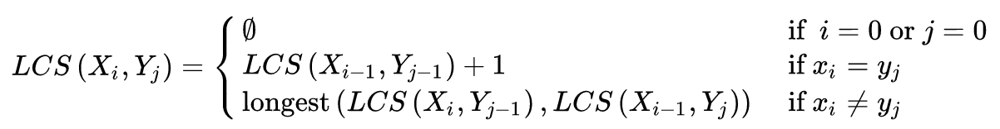

# 자주 나오는 주제

## LCS(최장 공통 부분 수열)
공통 부분 수열 중 **길이가 가장 긴** 부분 수열을 찾는 문제

`최적의 부분구조`와 겹치는 `부분문제 특성`을 가지기 때문에 점화식을 통해 푸는 `동적 프로그래밍`이라는 기법을 사용할 수 있다. 이 방법은 부분문제의 해답을 표에 저장하는 방식인 `메모이제이션`을 사용해 상위 단계의 부분문제에서 해답을 접근한다.

최장 증가 부분 수열은 다음과 같은 정의를 따른다.



1. 수열 A와 B 마지막이 같은 경우
- 이 경우 A[i] == B[j] 이고 이 원소는 최장 공통 부분 수열에 속할 것이다.
- A와 B의 LCS 길이는 마지막 문자를 줄인 수열 A와 B 간의 LCS에 공통 문자 길이 1을 더한 것이다.
- 즉, `LCS[i][j] = LCS[i - 1][j - 1] + 1`이다.
- 예를 들어, A = abcd, B = ad라고 하면 이 둘의 LCS 길이는 d를 제외하고 abc와 a 간의 LCS 길이 + 1이다.

2. 둘의 문자가 다른 경우
- 이 경우 A[i] != B[j]이며 A와 B의 마지막이 공통 부분 수열에 속하는지 모른다.
- 만약 A의 마지막 원소가 속하지 않을 경우 A에서 마지막 하나를 줄인 수열 A와 수열 B 간의 LCS는 기존과 같을 것이다.
- 즉, LCS[i][j] = LCS[i - 1][j]이다.
- 하지만 A의 원소가 속할 경우 B 수열에서 하나를 지워도 손실이 없다.
- 즉, LCS[i][j] = LCS[i][j - 1]이다.
- 결국, `LCS[i][j] = longest(LCS[i - 1][j], LCS[i][j - 1])`이다.

이 알고리즘을 통해 표를 만들어 계산한다.
예를들어 A = CDABE(i), B = CDEGT(j)일 경우,

|   |  <center>0</center> |  <center>C</center> |  <center>D</center> |  <center>E</center> |  <center>G</center> |<center>T</center> |
|:--------|:--------:|:--------:|:--------:|:--------:|:--------:|:--------:|
|**0** | <center>0 </center> |0|0|0|0|0|
|**C** | <center>0 </center> |1|1|1|1|1|
|**D** | <center>0 </center> |1|2|2|2|2|
|**A** | <center>0 </center> |1|2|2|2|2|
|**B** | <center>0 </center> |1|2|2|2|2|
|**E** | <center>0 </center> |1|2|3|3|3|

이런 식으로 표가 만들어 지는데, 여기서 젤 마지막 칸인 `(E, T)`가 LCS의 길이가 된다.

### Java 코드

``` Java
public static String LCS(String str1, String str2) {
  // 한 칸 더를 준 이유는 빈 수열일 칸을 고려.
  int[][] memoization = new int[str1.length() + 1][str2.length() + 1];

  // memoization 칸을 돌면서 칸을 채워 나감.
  for (int i = 0; i <= str1.length(); i++) {
    for (int j = 0; j <= str2.length(); j++) {
      if (i == 0 || j == 0) {
        // 빈 수열일 경우 0.
        memoization[i][j] = 0;
      } else if (str1.charAt(i - 1) == str2.charAt(j - 1)) {
        // 1번 규칙
        memoization[i][j] = memoization[i - 1][j - 1] + 1;
      } else {
        // 2번 규칙
        memoization[i][j] = Math.max(memoization[i - 1][j], memoization[i][j - 1]);
      }
    }
  }

  String ans = new String();
  // 역추적해서 문자 구하기
  int i = str1.length();
  int j = str2.length();

  while (i != 0 && j != 0) {
    if (memoization[i][j] > memoization[i - 1][j] && memoization[i][j] > memoization[i][j - 1]
        && memoization[i][j] > memoization[i - 1][j - 1]) {
      ans += str1.charAt(i - 1);

      i--;
      j--;
    } else if (memoization[i][j] > memoization[i - 1][j] && memoization[i][j] == memoization[i][j - 1]) {
      // 위가 더 작으므로 왼쪽으로
      j--;
    } else {
      // 왼쪽이 더 작으므로 위로
      i--;
    }
  }

  // 뒤집어진 상태이므로 StringBuilder를 통해 뒤집기.
  return new StringBuilder(ans).reverse().toString();
}
```
### Swift 코드

``` Swift
func LCS(str1: String, str2: String) -> String {
    var memoization: [[Int]] = Array(repeating: Array(repeating: 0, count: str2.count + 1), count: str1.count + 1)

    for i in memoization.indices {
        for j in memoization[i].indices {
            if i == 0 || j == 0 {
                memoization[i][j] = 0
            } else if Array(str1)[i - 1] == Array(str2)[j - 1] {
                memoization[i][j] = memoization[i - 1][j - 1] + 1
            } else {
                memoization[i][j] = max(memoization[i - 1][j], memoization[i][j - 1])
            }
        }
    }

    // 뒤로 추적하여 String을 리턴
    var i = str1.count
    var j = str2.count
    var ans = ""
    while i != 0 && j != 0 {
        print("\(i), \(j)")
        if memoization[i][j] > memoization[i - 1][j - 1] &&
            memoization[i][j] > memoization[i - 1][j] &&
            memoization[i][j] > memoization[i][j - 1] {
            ans += String(Array(str1)[i - 1])

            i -= 1
            j -= 1
        } else if memoization[i][j] > memoization[i - 1][j] &&
            memoization[i][j] == memoization[i][j - 1] {
            // 왼쪽과 같으므로
            j -= 1
        } else {
            i -= 1
        }
    }

    return String(ans.reversed())
}
```
