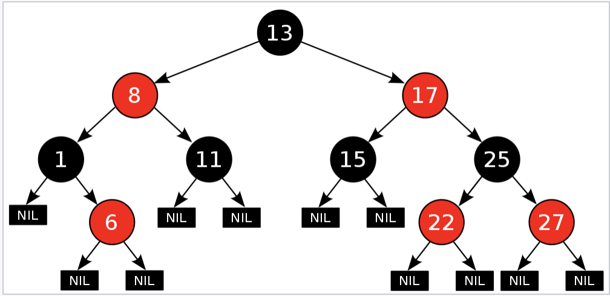
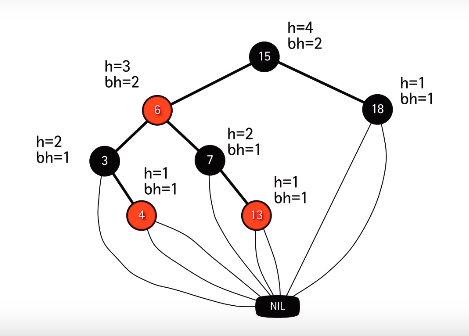

# Red Black Tree

레드-블랙 트리는 `자가 균형 이진 탐색 트리(self-balancing binary search tree)`로써, 복잡한 자료구조이지만, 실 사용에서 효율적이고, 최악의 경우에도 `O(log n)`의 삽입, 삭제, 검색 시간 복잡도를 보인다. 그래서 `함수형 프로그래밍`에서 특히 유용한데, 함수형 프로그래밍에서 `연관 배열(=Map, Dictionary)`이나 `집합(Set)` 등을 레드-블랙 트리로 구현해 놓은 경우가 많다.

## 특성



레드-블랙 트리는 `이진 탐색 트리(Binary Search Tree)`를 기반으로 각각의 노드가 **레드**나 **블랙**인 형태를 띄고 있으며 다음과 같은 추가적인 조건을 만족한다.

1. 노드가 레드 혹은 블랙 중의 하나이다.
2. 루트 노드는 블랙이다.
3. 모든 리프 노드(`nil`)는 블랙이다.
4. 레드 노드의 자식 노드 양쪽은 언제나 모두 블랙이다.(즉, 레드 노드는 연달아 나타날 수 없고, 블랙 노드만이 레드 노드의 부모 노드가 될 수 있다.)
5. 어떤 노드로부터 시작되어 리프 노드에 도달하는 모든 경로에는 리프 노드를 제외하면 모두 같은 갯수의 블랙 노드가 있다.

위 조건을 만족하면, `루트 노드로부터 리프 노드까지의 가장 먼 경로까지의 거리가, 가장 가까운 경로까지의 거리의 두 배보다 항상 작다.`라는 중요한 특성을 가지게 되는데, 이로써 레드-블랙 트리는 근사적으로 `균형을 이룬 트리`가 된다. 따라서 삽입, 삭제, 검색 시의 최악의 경우(worst-case)는 시간 복잡도가 트리의 높이에 따라 결정되기 때문에 보통의 이진 탐색 트리보다 **효율적**이라 할 수 있다.

### 빠른 시간 복잡도

레드-블랙 트리가 `O(log n)`이라는 빠른 시간 복잡도를 보이는 이유는 여기에 있다. `이진 탐색 트리`가 `검색`, `직전 원소`, `직후 원소`, `최솟값`, `최댓값`, `삽입`, `삭제` 같은 연산에서 `O(h)`의 시간 복잡도를 보이는 데, 이 같은 연산 과정은 레드-블랙 트리에서도 거의(**레드-블랙 트리만의 특성을 유지하려는 연산이 추가적으로 필요할 수 있음**) 동일하다. 그런데 레드-블랙 트리는 그만의 특성을 유지하려다 보니 높이가 `log n`만큼 제한이 되기 때문에 같은 연산에 대해서 O(log n)의 시간 복잡도를 가지게 된다.

리프 노드는 `경계 노드(sentinel)`이라고도 하는 데, nil 값이 아닌 정상적인 `key`값을 가진 노드를 `내부 노드`라고 한다. 위의 그림과 같이 경계 노드를 개별적으로 가질 수도 있지만 다음 그림과 같이 하나의 경계 노드만을 가지게 해 **저장 공간의 낭비**를 막을 수 있다.



## 동작

트리에서 탐색은 이진 탐색 트리의 동작과 다르지 않다. 그러나 `삽입(insertion)`과 `삭제(removal)`의 경우 이진 탐색 트리의 구현만으로는 레드-블랙 트리의 특성을 만족하지 못한다. 추가적인 작업이 더 필요한데 이 때 쓰이는 것이 `회전(rotation)`이다.

### 회전


- 우회전: 왼쪽 자식 노드를 부모 노드로 만들고, 왼쪽 자식 노드의 오른쪽 자식 노드를 원래 부모 노드의 왼쪽 자식으로 연결한다.
- 좌회전: 우측 자식 노드를 부모 노드로 만들고, 오른쪽 자식 노드의 왼쪽 자식 노드를 원래 부모 노드의 오른쪽 자식으로 연결한다.

``` java
// Q를 기준으로 트리 T를 우회전한다.
RIGHT-ROTATE(T, Q) {
  P = Q.left
  Q.left = P.right
  if P.right != T.nil {
    P.right.p = Q
  }
  P.p = Q.p
  if Q.p == T.nil {
    T.root = P
  } else if Q == Q.p.left {
    Q.p.left = P
  } else {
    Q.p.right = P
  }
  P.right = Q
  Q.p = P
}
// LEFT-ROTATE는 대칭이다.
```

이 같은 회전을 통해 레드-블랙 트리의 특성을 유지힌다.

### 삽입

삽입은 다음과 같은 과정으로 이루어진다.

1. `이진 탐색`을 통해 삽입될 데이터의 위치를 찾아 노드를 삽입한다.
2. 삽입 후, 그 노드를 레드로 만든다.
3. `T.nil`을 가진 자식 노드를 붙인다.

``` java
// 트리 T에 z를 삽입
RB-INSERT(T, z) {
  y = T.nil // z가 들어갈 위치의 부모 자리
  x = T.root // z가 들어갈 위치
  while x != T.nil { // 이진 탐색 트리처럼 위치를 탐색한다.
    y = x
    if z.key < x.key {
      x = x.left
    } else {
      x = x.right
    }
  }
  z.p = y
  if y == T.nil {
    T.root = z
  } else if z.key < y.key {
    y.left = z
  } else {
    y.right = z
  }
  z.left = T.nil
  z.right = T.nil
  z.color = RED
  RB-INSERT-FIXUP(T, z)
}
```

레드로 지정하는 이유는 `Black-Height` 변경을 최소화하기 위함이다. 삽입은 끝났지만 트리가 **특성 2**와 **특성 4**를 만족시키지 못하는 경우가 생긴다. 이 때문에 회전을 포함하는 추가적인 연산인 `RB-INSERT-FIXUP(T, z)`을 사용해 이것을 해결한다.

``` java
RB-INSERT-FIXUP(T, z) {
  while z.p.color == RED {
    if z.p == z.p.p.left {
      y = z.p.p.right // 삼촌 노드
      if y.color == RED {   
        z.p.color = BLACK      // 경우 1
        y.color = BLACK        // 경우 1
        z.p.p.color = RED      // 경우 1
        z = z.p.p              // 경우 1
      } else if z == z.p.right {
        z = z.p                // 경우 2
        LEFT-ROTATE(T, z)      // 경우 2
      } else {
        z.p.color = BLACK      // 경우 3
        z.p.p.color = RED      // 경우 3
        RIGHT-ROTATE(T, z.p.p) // 경우 3
      }
    }
    else {"right"와 "left"를 바꾼 경우}
  }
  T.root.color = BLACK
}
```

- 경우 1: z의 삼촌 y가 적색인 경우
- 경우 2: z의 삼촌 y가 흑색이며 z가 부모의 오른쪽 자식인 경우
- 경우 3: z의 삼촌 y가 흑색이며 z가 부모의 왼쪽 자식인 경우

`RB-INSERT(T, z)` 시 교정 전 연산에서 `O(log n)` 시간이 걸리고 `RB-INSERT-FIXUP(T, z)` 시에 경우 1에서만 `O(log n)`의 시간으로 반복되고, 경우 2와 경우 3의 경우 while 루프는 종료된다. 결과적으로 `O(log n)` 시간 복잡도를 가진다.

### 삭제

삭제도 마찬가지로 삽입과 마찬가지로 `이진 탐색 트리`의 연산과 비슷하지만 교정 작업이 추가된다. `이진 탐색 트리`에서도 그랬듯 한 원소의 삭제 시, 자식 원소의 서브 트리를 그 위치에 넣는 작업을 하는데 이것을 `TRANSPLANT`라 한다. 레드-블랙 트리에서는 이것을 약간 변형을 하여 사용한다.

``` java
RB-TRANSPLANT(T, u, v) {
  if u.p == T.nil {
    T.root = v
  } else if u == u.p.left {
    u.p.left = v
  } else {
    u.p.right = v
  }
  v.p = u.p
}
```

``` java
RB-DELETE(T, z) {
  y = z
  y-original-color = y.color
  if z.left == T.nil {
    x = z.right
    RB-TRANSPLANT(T, z, z.right) // z의 오른쪽 자식 서브트리를 z의 위치에 넣는다.
  } else if z.right == T.nil {
    x = z.left
    RB-TRANSPLANT(T, z, z.left) // z의 왼쪽 자식 서브트리를 z의 위치에 넣는다.
  } else { // z의 자식이 둘 다 존재할 경우
    y = TREE-MINIMUM(z.right) // z의 직후 원소를 y로 함.
    y-original-color = y.color
    x = y.right
    if y.p == z {
      x.p = y
    } else {
      RB-TRANSPLANT(T, y, y.right)
      y.right = z.right
      y.right.p = y
    }
    RB-TRANSPLANT(T, z, y)
    y.left = z.left
    y.left = z.left
    y.left.p = y
    y.color = z.color
  }
  if y-original-color == BLACK {
    RB-DELETE-FIXUP(T, x)
  }
}
```

새로 `z`의 자리에 오게 되는 `y`가 검정색일 경우 레드-블랙 트리의 특성을 위반할 경우가 생기기 때문에 추가적인 연산이 필요하다.

``` java
RB-DELETE-FIXUP(T, x) {
  while x != T.root && x.color == BLACK {
    if x == x.p.left {
      w = x.p.right // x의 형제
      if w.color == RED { // 경우 1
        w.color = BLACK
        x.p.color = RED
        LEFT-ROTATE(T, x.p)
        w = x.p.right
      }
      if w.left.color == BLACK && w.right.color == BLACK { // 경우 2
        w.color = RED
        x = x.p
      } else if w.right.color == BLACK { // 경우 3
        w.left.color = BLACK
        w.color = RED
        RIGHT-ROTATE(T, w)
        w = x.p.right
      } else { // 경우 4
        w.color = x.p.color
        x.p.color = BLACK
        w.right.color = BLACK
        LEFT-ROTATE(T, x.p)
        x = T.root // 루프 종료
      }
    } else {"right"와 "left"를 바꿔 실행}
  }
  x.color = BLACK
}
```

교정 연산을 제외했을 때 `O(log n)`의 시간이 걸리고, `RB-DELETE-FIXUP` 실행 시 경우 2에서만 `O(log n)`이 소요되어 총 수행시간은 `O(log n)`이 걸린다.

## Reference

- Introduction to Algorithms, 3rd edition, Thomas H. Cormen, 한빛 아케데미
