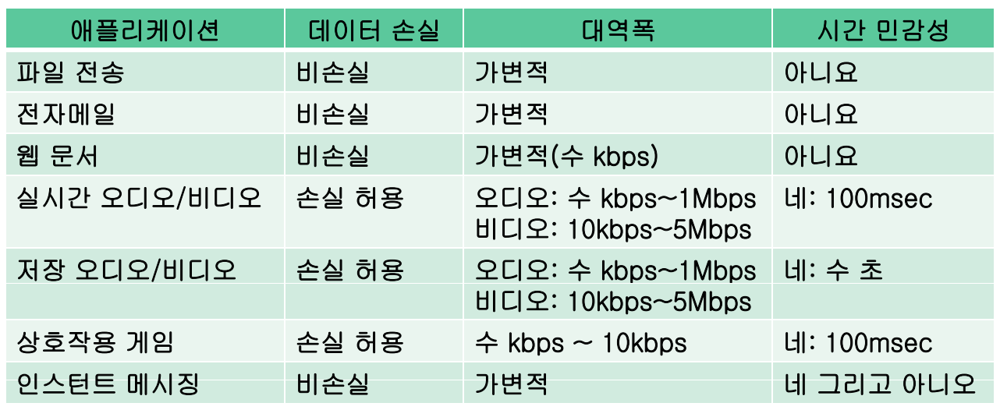
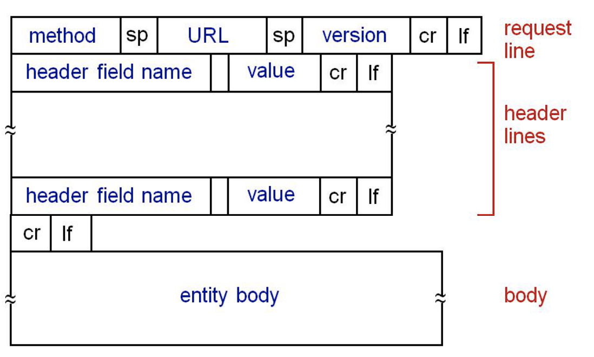

# 네트워크 2차시

# Chapter 2: Application Layer

## Application architectures
네트워크 어플리케이션과 프로토콜이 아래 두 가지 구조를 가진다.

### Client-server
- server
    - **언제나 on 상태**의 호스트
    - 영구적인 IP 주소
    - 데이터 센터의 형태로 큰 규모를 수행할 수 있음
- client
    - 서버랑 통신
    - 서로 통신하지는 않음
    - **간헐적**으로 연결
    - 동적인 IP 주소(인터넷이 연결될 때마다 변경될 수 있음)

### P2P
서버가 없는 구조로 유저 시스템끼리 통신한다. 이 유저 시스템을 *peer*라고 한다. peer가 요청을 하기도 하고 받기도 한다.

P2P의 가장 큰 특징은 **self scalability**이다. 클라이언트-서버 구조에서는 서버가 규모 확장성을 지원하지만 P2P에서는 새 peer가 새 capacity를 갖고 오게 된다.

peer들이 간헐적으로 연결되고 IP 주소가 바뀌기 때문에 관리가 어렵다는 단점을 보인다.

## Process communicating
호스트끼리는 통신하지 않는다. 정확히 말하면 **호스트 안의 프로세스끼리** 통신을 하는 것이다. 통신하는 프로세스의 종류에는 두 가지가 있다.

- client process: 통신을 시작하는 프로세스.
- server process: 연결되기 기다리는 프로세스.

> P2P에서는 두 종류의 프로세스가 둘 다 있을 수도 있다.

### Sockets
어플리케이션은 메시지를 만들고 이를 운영체제의 transport 계층에 부탁해 전달하게 되는데 이 때 전달되는 문, 경로가 **소켓**(**Socket**)이다. 반대로 받아오는 메시지도 소켓을 통해 들어오게 된다.

### 주소
호스트의 IP 주소만을 가지고는 도착점 프로세스를 특정할 수 없기 때문에 *포트(port)* 번호를 같이 집어 넣어 식별한다. 예를 들어 HTTP 서버는 80, mail 서버는 25이다.

## 응용 프로그램은 어떤 특성을 요구할까?
각 응용 프로그램의 특성에 따라 다르다.
- Data integrity: 데이터의 무결성. 조작되지 않아야 함.
    - 멀티미디어 어플리케이션은 데이터의 손실이 있어도 사람이 잘 눈치채지 못 할 정도이기 때문에 허용할 수 있음. 대신 원활한 재생을 위한 최소 throughput을 요함.
- Timing: 딜레이가 짧아야 함. 인터넷 전화, 원격 회의, 다자간 게임 같은 경우가 예가 될 수 있다.
- Throughput: 미디어 스티리밍 같은 경우 단위 시간당 최소 프레임을 요하기 때문에 최소 throughput을 충족시켜야 함.
    - 전자 메일, 파일 전송, 웹 같은 경우는 유연하게 대처할 수 있기 때문에 처리율에 덜 민감하다.
- Security: 보안

## 인터넷 전송 프로토콜 서비스

### TCP
- 안전한 전송.
- 상대방과 연결을 해야함. 이것은 *hand-shaking* 과정을 거침.
- flow control: 보내는 프로세스(sender)가 **받는 프로세스**(**receiver**)에서 오버플로우가 일어나게 하지 않도록 조절.
- congestion control: **네트워크** 상에서 컨트롤하는 것으로 패킷 로스가 일어나지 않도록 한다.
- 위와 같은 제어를 하기 위해 OS가 버퍼를 할당함.

### UDP
- 신뢰하지 못하는 전송.

공통적으로 두 전송 프로토콜 서비스 모두 **타이밍, 최소 쓰루풋 보장, 보안 기능은 지원하지 않는다.** 멀티미디어 어플리케이션이 많이 등장하면서 이 같은 기능들이 중요해졌지만 제대로 지원되지는 않아 연구가 계속되고 있다.

TCP가 UDP보다 훨씬 나은 것처럼 보인다. 그러나 다음과 같은 상황에서 UDP가 선호된다.

- TCP가 위와 같은 다양한 기능을 하기 위해서는 커넥션 셋업과 끝난 후 클린업 등 오버헤드가 따르는 작업을 수행해야 한다. 만약 한 번 메시지를 주고 받는 작업의 경우, 배보다 배꼽이 더 큰 상황이 벌어질 수도 있다.
- 역설적으로 어플리케이션 단에서 데이터의 무결성을 검사하는 일을 할 경우, TCP에서 한 번 더 검사할 필요를 못 느끼기 때문에 UDP를 사용한다.
- 미디어 스트리밍 같은 경우 일정 쓰루풋이 필요한 데 만약 네트워크 상에서 congestion이 일어날 수 있으면 TCP는 데이터의 전송을 막아 버린다. 그 결과 미디어의 스트리밍이 제대로 일어날 수 없게 된다.

## 어플리케이션 프로토콜

### HTTP(Hypertext transfer protocol)
웹을 위해서 만들어진 프로토콜. 웹 페이지는 오브젝트들의 구성으로 이루어져 있는데 **URL**로 주소가 표현이 된다. 가장 보편적인 프로토콜 중의 하나이기 때문에 언제나 80번 포트를 사용한다.

클라이언트-서버 구조로 되어 있다.
- 클라이언트: 브라우저에 해당. 서버에 요청을 하고 받은 웹의 오브젝트들을 보여준다.
- 서버: 웹 서버 호스트에 존재하며 웹 브라우저가 요청한 것을 처리한다.

주로 TCP를 사용하는데, 그 이유는 주 사용 앱인 웹은 **데이터의 무결성**이 중요하기 때문이다. TCP 연결을 시작하자고 요청을 하면 핸드 쉐이킹이 이루어지고 연결이 된다. 이 때부터 클라이언트는 요청을 보내고 서버는 응답을 한다. 모든 작업이 완료되면 연결이 끊어지게 된다.

#### Stateless
서버는 클라이언트의 과거 요청들에 대한 정보를 유지하지 않는다.
> 상태를 유지하는 일은 복잡하다. 과거의 기록들(상태)를 유지 관리해야 하기 때문에 그에 따른 오버헤드가 발생하고 서버나 클라이언트 중 하나가 깨진 경우 상태가 서로 불일치하게 되어 동기화가 필요하다.

#### 두가지 종류: 비지속 연결과 지속 연결
- 비지속 연결
    - 요구/응답 쌍이 분리된 TCP 연결을 통해 송수신
    - 하나의 TCP 연결로 하나의 객체만 전송
    - 서버는 **응답을 한 후 바로 TCP 연결을 끊어버림**.
    - 다수의 객체를 받으려면 여러 번 TCP 연결을 시도해야 함.
    - 응답 시간: (2 RTT(Round-Trip Time) + 파일 전송 시간) * 오브젝트의 갯수
    - **병렬 TCP 연결**을 통해 동시에 오브젝트들을 가져오는 시도를 하기도 함.
- 지속 연결
    - 모든 요구/응답 쌍이 같은 TCP 연결 상에서 송수신
    - 다수의 객체들이 하나의 TCP 연결로 전송
    - 서버가 **응답을 보낸 후에도 TCP 연결을 유지**. 이 연결을 통해 이후의 메시지들도 송수신함.
    - 모든 참조 객체들에 대해 1 RTT만 필요.

#### HTTP 요청 메시지
아스키 코드로 구성되어 있음.

구성은 **request line + header lines + body**

검색어 입력 같은 폼 입력을 받을 때는 다음과 같은 메서드를 사용한다.
- POST 방식: *entity body*에 입력한 내용을 실어서 보내게 된다.
- URL 방식: GET 방식을 그대로 쓰면서 URL 필드로 서버에 업로드 한다.

#### HTTP 응답 메시지

응답 상태 코드에는 다음과 같은 것들이 있다.
- 200: OK
- 301: Moved Permanently
- 400: Bad Request
- 404: Not Found
- 505: HTTP Version Not Supported

#### 쿠키(Cookie)
HTTP가 stateless한 특성을 가지고 있기 때문에 **사용자 상태**를 추적하고 유지하도록 쿠키를 사용한다.

처음 연결이 되면 서버는 사용자의 고유 식별자(unique id)를 내어주게 되고 클라이언트는 이것을 쿠키에 저장하게 된다. 다음 연결 시에 이 고유 식별자를 포함하는 연결을 하게 되고 서버는 이것을 통해 과거의 기록을 볼 수 있다.

쿠키의 용도는 다음과 같다.
- 사용자 인증
- 쇼핑 카트
- 제품 추천
- 사용자 세션 상태(웹 이메일)

#### 웹 캐시(Web caches)
브라우저가 캐시에 요청을 하게끔 함. 만약에 없다면 그제서야 서버에 요청하게 됨. 그렇기 때문에 웹 캐시는 **클라이언트와 서버의 역할을 동시에 수행**해야 한다. 웹 캐시를 다른 말로 **프록시 서버**라고도 한다.

일반적으로 ISP(대학, 회사, 인터넷 업체)에 의해 설치된다. 그 이유는
- 클라이언트의 요청에 대한 응답 시간을 줄일 수 있다.
- 기관의 access link에 대한 웹 트래픽을 줄일 수 있다.
- 자금이 넉넉치 않은 컨텐츠 제공자가 빠르게 컨텐츠를 공급할 수 있게 있다.

웹 캐시는 자신이 가지고 있는 오브젝트를 서버의 오브젝트와 동기화하기 위해 **조건부 GET**을 사용한다. 즉, 최신 데이터면 가져오지 않고 바로 보여주고, 그렇지 않은 경우에는 최신 데이터를 가져오는 GET을 실행한다. 이것을 항상 할 경우 과거의 오브젝트를 보여주지는 않지만 비용이 많이 든다.

### 이메일 프로토콜
3개의 주요 요소가 있다.
- 사용자 에이전트: 메일을 읽고, 작성하고, 보내는 역할을 하며 Outlook, Mail 앱 같은 것을 말한다.
- 메일 서버: 받은 메시지를 유지하고 관리하는 *메일 박스*와 보낼 메일을 담고 있는 *메시지 큐*가 있다.
- 메일 프로토콜: 보낼 때 *SMTP*를 통해 메일 서버에 전달하고 메일을 받아 사용자 에이전트가 읽을 때는 *POP*이나 *IMAP*을 사용한다.

#### SMTP 프로토콜
클라이언트의 메일 메시지를 보내는 역할을 하며 TCP 연결을 사용한다. 포트 번호는 25이다. 3단계의 전송 과정을 거치며 *핸드셰이킹 -> 메시지 전송 -> 종료* 로 이루어진다.

SMTP의 *명령*은 ASCII 문자로 되어 있고 *응답*은 상태 코드와 문장으로 이루어진다. 초기에는 유저의 메시지가 ASCII 코드만 포함했지만 지금은 다른 것들도 많이 추가되었다.

#### HTTP vs. SMTP
둘 다 ASCII 코드로 명령과 응답을 한다.
- HTTP
    - pull
    - 하나의 응답 메시지에 하나의 오브젝트만 넣는다.
- SMTP
    - push
    - 메시지에 여러 오브젝트들을 넣을 수 있다.

