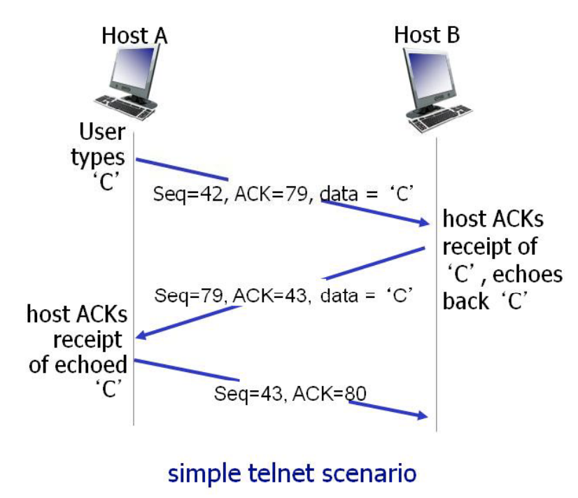

# 네트워크 4차시

# Chapter3: Transport Layer
어플리케이션 프로세스 사이의 논리적 통신(logical communication)을 담당하는 계층.

## 트랜스포트 계층 vs. 네트워크 계층
- 트랜스포트 계층
    - 프로세스 to 프로세스
    - 네트워크 계층의 서비스에 의존
- 네트워크 계층
    - 호스트 to 호스트

## Multiplexing(다중화)/demultiplexing(역다중화)
- 보내는 쪽(송신): 어플리케이션 계층에서 *메시지*의 형태로 데이터를 주면 **하나하나에 목적지 프로세스의 주소를 찍어** 네트워크 계층에 이것들을 모아 한 줄로 내려보낸다. 이 과정이 *다중화*이다.
- 받는 쪽(수신): 올바른 주소로 전달하기 위해 *역다중화* 과정을 거친다. 이 때 사용되는 것이 **세그먼트의 헤더 안에 포함되어 있는 포트 번호**이다.

### 비연결형(Connectionless) 역다중화
- 포트번호를 갖는 소켓을 생성
- UDP 소켓은 목적지 IP 주소, 목적지 포트번호로 구분하여 이것이 같으면 같은 소켓에 전달

### 연결지향형(Connection-Oriented) 역다중화
- TCP는 4개 요소로 구분
    - 출발지 IP 주소, 출발지 포트번호: 어느 어플리케이션에서 왔는지 확인!
    - 목적지 IP 주소, 목적지 포트번호: 잘 왔는지 확인!
- TCP에서는 하나의 어플리케이션이 여러 소스로부터 오는 것들을 각기 다른 소켓에서 받기 때문에 소스의 주소도 필요

## UDP: User Datagram Protocol
- IP에 최소 기능만 추가
- 최선형(best effort) 서비스
    - **손실이 날 수도 있음.**
    - **순서가 어긋날 수도 있음.**
- "connectionless"한 프로토콜로 핸드 셰이킹이 없고 *각각의 세그먼트는 독립적으로 취급*된다. 그렇기 때문에 위에서 언급한 문제점이 발생.
- 사용 예
    - 스트리밍 멀티미디어(손실 감내, 최소 쓰루풋(전송률)을 요구)
    - DNS
    - SNMP(네트워크 관리 프로토콜)
- UDP 상에서 신뢰적인 전송(반복적인 에러 체크 지양)
    - 어플리케이션 계층에서 신뢰성을 추가
    - 어플리케이션에서 에러 복구

### UDP 세그먼트 헤더
지연을 유발하는 연결 설정이 없고 연결 상태를 담지 않기 때문에 헤더의 크기가 작아 패킷 오버헤드도 작다. 그래서 그만큼 빨리 전달할 수 있다.

### UDP 체크섬
전송된 세그먼트의 오류를 검출하는 것으로 16 bit 정수의 열을 통해 보수 합을 계산. 하지만 모든 에러를 다 발견할 수 없다.

## 신뢰성 있는 데이터 전송의 원리
다음의 요소를 갖추어야 한다.
- Checksum: 오류 검출.
- Acknowledgement: 잘 받았다는 것을 알려줌.
- Negative acknowledgement: 잘못 온 것을 알려줌.
- Timer: 일정 시간 내에 이뤄져야 함. 세그먼트나 ACK이 사라질 경우 다시 데이터를 요청하거나 보냄.
- Window, pipelining: 받았다는 ACK가 오지 않아도 계속 데이터를 넣음으로써 효율적으로 전송하도록 함.
- Sequence number: 보내는 것을 또 보내는 경우가 있기 때문에 붙여서 보냄.

## TCP: Transmission Control Protocol
- point to point(하나의 송신자, 하나의 수신자)
- 신뢰적인, 순서가 유지되는 바이트 **스트림**
- 파이프 라인
- full duplex: **양방향**의 데이터 흐름.
- 송신 버퍼, 수신 버퍼를 유지
- 연결 지향형: 핸드 셰이킹을 통해 연결을 셋업.
- 흐름 제어(flow control)

### TCP 세그먼트 구조
- 시퀀스 넘버: 내가 실은 데이터의 스트림 번호.
- ACK: 상대방으로부터 기대하는 데이터의 번호.
- URG, PSH는 지금은 쓰지 않는 플래그이다.

### TCP round trip time, timeout
- timeout value: 너무 짧으면 불필요하게 다시 전송을 하고, 너무 길면 세그먼트 손실에 대해 너무 늦은 반응이 된다. 그래서 일정 기간 동안의 평균에 safety margin을 고려하여 timeout 값을 결정한다.

### TCP 신뢰적 데이터 전달
TCP는 비신뢰적인 인터넷 네트워크 계층(IP 서비스) 상위 계층에서 *신뢰적인 데이터 전달* 서비스를 제공
- 파이프라인되는 세그먼트
- 누적 ACKs(cumulative ACKs)
- **단일** 재전송 타이머

#### TCP 송신자 이벤트

##### "상위 어플리케이션으로부터 수신된 데이터" 이벤트
- seq.num을 포함한 세그먼트 생성
- seq.num은 세그먼트에서 첫 번째 바이트의 바이트 스트림 번호
- 타이머가 이미 동작중이 아니면 타이머를 시작
- TCP에서의 타이머는 가장 최근에 내보낸 세그먼트 중 아직 ACK을 받지 않은 것에 달아둠

##### "타이머 타임아웃" 이벤트
- 타임아웃을 유발한 세그먼트를 재전송
- 타이머를 다시 시작

##### "ACK 수신" 이벤트
- 해당 세그먼트를 ACK 응답된 세그먼트로 표시
- 아직 ACK 응답을 받지 못한 세그먼트들이 존재하면 타이머를 시작

#### TCP 수신자 이벤트
- 순서에 맞는 세그먼트 도착
    - 이 순서 전까지 모든 데이터 수신: ACK를 500ms까지 기다렸다 보냄. 바로 다른 세그먼트가 올 수도 있기 때문에 기다림.
    - ACK 전송을 준비하는 다른 세그먼트가 존재: 즉시 *하나의 누적 ACK*를 전송.
- 순서가 틀린 세그먼트 도착: 즉시 기다리고 있었던 순서번호를 나타내는 **중복 ACK**를 전송.
- 간격을 부분적 또는 모두 채우는 세그먼트 도착: 간격의 최저값부터 세그먼트가 시작된다면 즉시 ACK를 전송.

##### 빠른 재전송
송신자가 같은 데이터에 대해 **3개의 중복 ACK를 수신**하게 되면 받으려고 하는 세그먼트가 손실되었다고 가정하여 타이머가 완료되기 전에 재전송함.

