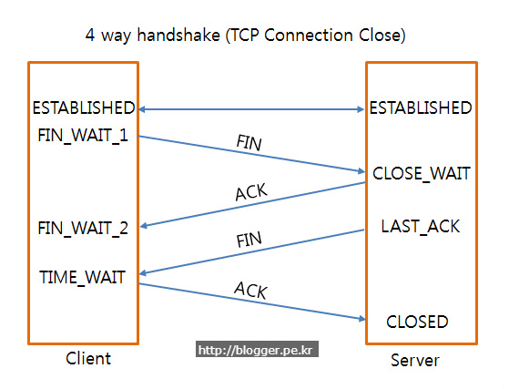

# 네트워크 4차시

# Chapter3: Transport Layer
어플리케이션 프로세스 사이의 논리적 통신(logical communication)을 담당하는 계층.

## 트랜스포트 계층 vs. 네트워크 계층
- 트랜스포트 계층
    - 프로세스 to 프로세스
    - 네트워크 계층의 서비스에 의존
- 네트워크 계층
    - 호스트 to 호스트

## Multiplexing(다중화)/demultiplexing(역다중화)
- 보내는 쪽(송신): 어플리케이션 계층에서 *메시지*의 형태로 데이터를 주면 **하나하나에 목적지 프로세스의 주소를 찍어** 네트워크 계층에 이것들을 모아 한 줄로 내려보낸다. 이 과정이 *다중화*이다.
- 받는 쪽(수신): 올바른 주소로 전달하기 위해 *역다중화* 과정을 거친다. 이 때 사용되는 것이 **세그먼트의 헤더 안에 포함되어 있는 포트 번호**이다.

### 비연결형(Connectionless) 역다중화
- 포트번호를 갖는 소켓을 생성
- UDP 소켓은 목적지 IP 주소, 목적지 포트번호로 구분하여 이것이 같으면 같은 소켓에 전달

### 연결지향형(Connection-Oriented) 역다중화
- TCP는 4개 요소로 구분
    - 출발지 IP 주소, 출발지 포트번호: 어느 어플리케이션에서 왔는지 확인!
    - 목적지 IP 주소, 목적지 포트번호: 잘 왔는지 확인!
- TCP에서는 하나의 어플리케이션이 여러 소스로부터 오는 것들을 각기 다른 소켓에서 받기 때문에 소스의 주소도 필요

## UDP: User Datagram Protocol
- IP에 최소 기능만 추가
- 최선형(best effort) 서비스
    - **손실이 날 수도 있음.**
    - **순서가 어긋날 수도 있음.**
- "connectionless"한 프로토콜로 핸드 셰이킹이 없고 *각각의 세그먼트는 독립적으로 취급*된다. 그렇기 때문에 위에서 언급한 문제점이 발생.
- 사용 예
    - 스트리밍 멀티미디어(손실 감내, 최소 쓰루풋(전송률)을 요구)
    - DNS
    - SNMP(네트워크 관리 프로토콜)
- UDP 상에서 신뢰적인 전송(반복적인 에러 체크 지양)
    - 어플리케이션 계층에서 신뢰성을 추가
    - 어플리케이션에서 에러 복구

### UDP 세그먼트 헤더
지연을 유발하는 연결 설정이 없고 연결 상태를 담지 않기 때문에 헤더의 크기가 작아 패킷 오버헤드도 작다. 그래서 그만큼 빨리 전달할 수 있다.

### UDP 체크섬
전송된 세그먼트의 오류를 검출하는 것으로 16 bit 정수의 열을 통해 보수 합을 계산. 하지만 모든 에러를 다 발견할 수 없다.

## 신뢰성 있는 데이터 전송의 원리
다음의 요소를 갖추어야 한다.
- Checksum: 오류 검출.
- Acknowledgement: 잘 받았다는 것을 알려줌.
- Negative acknowledgement: 잘못 온 것을 알려줌.
- Timer: 일정 시간 내에 이뤄져야 함. 세그먼트나 ACK이 사라질 경우 다시 데이터를 요청하거나 보냄.
- Window, pipelining: 받았다는 ACK가 오지 않아도 계속 데이터를 넣음으로써 효율적으로 전송하도록 함.
- Sequence number: 보내는 것을 또 보내는 경우가 있기 때문에 붙여서 보냄.

## TCP: Transmission Control Protocol
- point to point(하나의 송신자, 하나의 수신자)
- 신뢰적인, 순서가 유지되는 바이트 **스트림**
- 파이프 라인
- full duplex: **양방향**의 데이터 흐름.
- 송신 버퍼, 수신 버퍼를 유지
- 연결 지향형: 핸드 셰이킹을 통해 연결을 셋업.
- 흐름 제어(flow control)

### TCP 세그먼트 구조
- 시퀀스 넘버: 내가 실은 데이터의 스트림 번호.
- ACK: 상대방으로부터 기대하는 데이터의 번호.
- URG, PSH는 지금은 쓰지 않는 플래그이다.

### TCP round trip time, timeout
- timeout value: 너무 짧으면 불필요하게 다시 전송을 하고, 너무 길면 세그먼트 손실에 대해 너무 늦은 반응이 된다. 그래서 일정 기간 동안의 평균에 safety margin을 고려하여 timeout 값을 결정한다.

### TCP 신뢰적 데이터 전달
TCP는 비신뢰적인 인터넷 네트워크 계층(IP 서비스) 상위 계층에서 *신뢰적인 데이터 전달* 서비스를 제공
- 파이프라인되는 세그먼트
- 누적 ACKs(cumulative ACKs)
- **단일** 재전송 타이머

#### TCP 송신자 이벤트

##### "상위 어플리케이션으로부터 수신된 데이터" 이벤트
- seq.num을 포함한 세그먼트 생성
- seq.num은 세그먼트에서 첫 번째 바이트의 바이트 스트림 번호
- 타이머가 이미 동작중이 아니면 타이머를 시작
- TCP에서의 타이머는 가장 최근에 내보낸 세그먼트 중 아직 ACK을 받지 않은 것에 달아둠

##### "타이머 타임아웃" 이벤트
- 타임아웃을 유발한 세그먼트를 재전송
- 타이머를 다시 시작

##### "ACK 수신" 이벤트
- 해당 세그먼트를 ACK 응답된 세그먼트로 표시
- 아직 ACK 응답을 받지 못한 세그먼트들이 존재하면 타이머를 시작

#### TCP 수신자 이벤트
- 순서에 맞는 세그먼트 도착
    - 이 순서 전까지 모든 데이터 수신: ACK를 500ms까지 기다렸다 보냄. 바로 다른 세그먼트가 올 수도 있기 때문에 기다림.
    - ACK 전송을 준비하는 다른 세그먼트가 존재: 즉시 *하나의 누적 ACK*를 전송.
- 순서가 틀린 세그먼트 도착: 즉시 기다리고 있었던 순서번호를 나타내는 **중복 ACK**를 전송.
- 간격을 부분적 또는 모두 채우는 세그먼트 도착: 간격의 최저값부터 세그먼트가 시작된다면 즉시 ACK를 전송.

##### 빠른 재전송
송신자가 같은 데이터에 대해 **3개의 중복 ACK를 수신**하게 되면 받으려고 하는 세그먼트가 손실되었다고 가정하여 타이머가 완료되기 전에 재전송함.

### TCP 흐름 제어
흐름 제어는 송신자가 데이터를 너무 빠르게 전송하여 수신자의 버퍼(소켓 레이어에 존재)를 오버플로우 시키는 것을 방지하는 서비스이다.

수신자는 TCP 송신 세그먼트의 헤더에 여유 버퍼 공간을 *rwnd*라는 값에 포함시켜 송신자에게 알려줌. 송신자는 이것을 보고 ACK이 안된 데이터의 양이 수신자의 rwnd 여유 공간보다 작은 값을 가지도록 유지한다.

### TCP 연결 관리
TCP 송신자/수신자는 데이터 교환 전에 3-way handshake를 한다. 2-way가 아니라 3-way를 하는 이유는 둘다 alive가 보장된 상태에서 통신을 하려고 하기 때문이다. 만약 그렇지 않을 경우 쓸모없는 쓰레기 데이터가 발생할 수 있다.

#### 3-way handshake 과정: 연결 성립(Connection Establishment)

1. 클라이언트는 서버에 접속을 요청하는 **SYN**(**a**) 패킷을 보낸다.
2. 서버는 클라이언트의 요청인 **SYN**(**a**)을 받고 클라이언트에게 요청을 수락한다는 **ACK**(**a+1**)과 **SYN**(**b**)가 설정된 패킷을 발송한다.
3. 클라이언트는 서버의 수락 응답인 **ACK**(**a+1**)과 **SYN**(**b**) 패킷을 받고 **ACK**(**b+1**)을 서버로 보내면 연결이 성립된다.

#### 4-way handshake 과정: 연결 해제(Connection Close)

1. 클라이언트가 연결을 종료하겠다는 FIN 플래그를 전송한다.
2. 서버는 클라이언트의 종료 요청(FIN)을 받고 알겠다는 확인으로 ACK를 보낸다.
    1. 서버는 데이터를 모두 보낼 때까지 잠깐 TIME_OUT 상태가 된다.
3. 데이터를 모두 보내고 통신이 끝났으면 연결이 종료되었다고 클라이언트에게 FIN 플래그를 전송한다.
4. 클라이언트는 FIN 메시지를 확인했다는 ACK를 보낸다.
5. 클라이언트의 ACK 메시지를 받은 서버는 소켓 연결을 Close한다.
6. 클라이언트는 아직 서버로부터 받지못한 데이터가 있을 것을 대비해 일정 시간동안 세션을 남겨놓고 아직 오지 못한 패킷을 기다리는 TIME_WAIT 과정을 거친다.

### Congestion control
- 혼잡(congestion): "네트워크가 감당할 수 없을 정도로 너무 많은 출발지(source)에서 너무 많은 데이터를 너무 빨리 송신"하는 것이 원인

#### 혼잡을 해결하기 위한 접근법
- 종단간의 혼잡제어(end-end congestion control)
    - 네트워크 계층에서 혼잡제어를 위한 피드백이나 지원 없음
    - 엔드 시스템에서 관찰된 패킷 손실 및 지연에 기초하여 혼잡을 추측
    - **TCP가 사용**하는 방법
- 네트워크 지원 혼잡 제어(network-assisted congestion control)
    - 라우터가 종단 시스템에게 혼잡 상태에 관한 피드백을 제공

#### AIMD(Additive-Increase, Multiplicative-Decrease)
- Additive increase: 손실이 감지될 때까지 매 RTT(round trip time)마다 전송률을 1 MSS(Maximum Segment Size)만큼 증가
- Multiplicative decrease: 손실 발생 후에 전송률을 반으로 줄임

#### TCP Slow Start
TCP는 처음 cwnd를 1 MSS로 설정하고 이를 ACK이 올 때마다 지수적으로, 두 배씩 늘려 나간다.(1 -> 2 -> 4...)

#### TCP Congestion Avoidance
지수적으로 늘려가다가 특정 임계치에 닿으면 1 MSS씩 선형적으로, 천천히 늘려 나간다. 이 임계값은 loss가 일어나면 반으로 수정이 된다.

