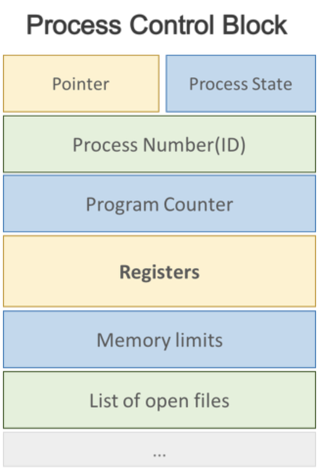
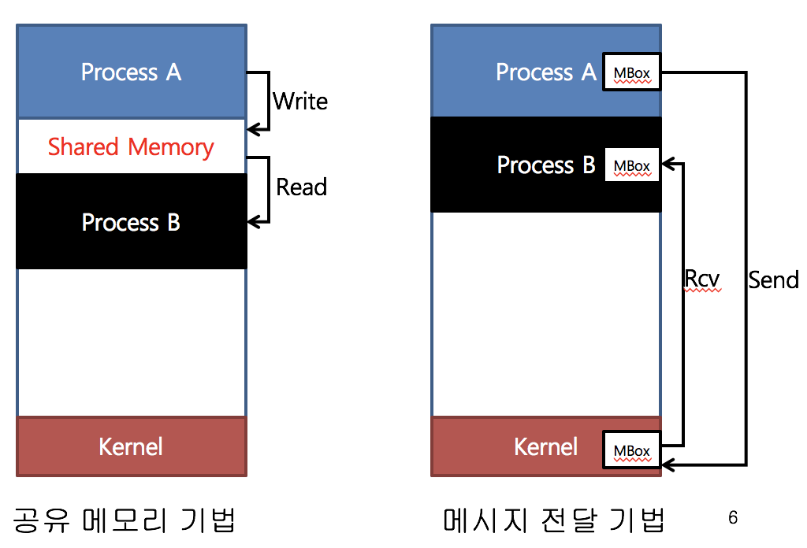
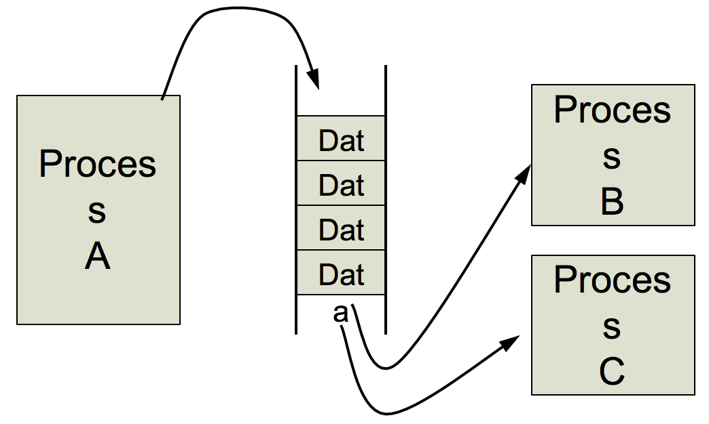

# 3장 프로세스
## 3.1 프로세스란?
- 실행중인 프로그램으로 디스크로부터 메모리에 적재되어 CPU의 할당(스케줄링)을 받을 수 있는 존재로 종종 **작업(task)** 과 거의 같은 의미이다.
- 프로그램이 일반적으로 하드에 저장된 명령 코드의 모음인 수동적인 존재인 반면 프로세스는 다음에 실행할 명령어를 지정하는 프로그램 카운터 및 관련된 자원의 집합을 가진 작업 단위이자 능동적인 존재
- Execution unit(스케줄링의 단위)이자 Protection Domain(서로 침범할 수 없음)이다.
- 프로세스의 구성
  - 텍스트 섹션: 프로그램 코드.
  - 스택: 매개 변수, 복귀 주소, 로컬 변수 저장.
  - 데이터 섹션: 전역 변수를 저장.
  - 힙: 동적으로 할당되는 것들을 저장.

## 3.2 프로세스의 상태

- 새로운(New): 프로세스가 생성되고 있음.
- 실행(Running): 프로세스가 실행중.
- 대기(Waiting): 어떤 이벤트를 기다리고 있는중(예를 들어 I/O 이벤트가 끝나기를 기다림).
- 준비완료(Ready): CPU 할당을 기다림.
- 종료(Terminated): 실행을 마침.

## 3.3 프로세스 제어 블록(Process Control Block, PCB)
- PCB는 특정 프로세스에 대한 중요한 정보를 저장하고 있는 자료구조.
- 프로세스 생성과 함께 만들어지며 프로세스의 작업 중단 시 기록, 재개할 때 이것을 이용한다.

- 구성요소
  - 프로세스 식별자(PID)
  - 프로세스 상태
  - 프로세스 카운터: 다음에 실행할 명령어의 주소를 저장
  - CPU 레지스터
  - CPU 스케줄링 정보: 프로세스의 우선순위 등 스케줄링에 필요한 정보
  - 메모리 관리 정보
  - 입출력 상태 정보: 프로세스에 할당된 I/O장치들과 열린 목록
  - 회계 정보: 사용한 CPU 시간, 시간제한, 계정번호 등

## 3.4 프로세스 스케줄
스케줄링의 목적은 CPU 사용률과 처리량의 최대화.

- 프로세스 분류에 따른 CPU Burst 특징
  - CPU-bound 프로세스: 연산 작업을 많이 하며 짧은 주기의 긴 CPU burst를 가짐.
  - I/O-bound 프로세스: I/O 작업을 많이 하며 긴 주기의 짧은 CPU burst를 가짐.
  - 어떤 종류의 프로세스가 많은지에 따라 스케줄링 기법의 효율성이 달라짐.

- 프로세스를 스케줄링하기 위한 세 가지 큐
  - Job Queue: 현재 시스템 내의 모든 프로세스의 집합.
  - Ready Queue: 주 메모리에 존재하면서, 준비완료 상태에서 실행을 대기하는 프로세스의 집합.
  - Device Queue: Device I/O 작업을 대기하고 있는 프로세스의 집합.

### 장기 스케줄러(Long-term scheduler / Job scheduler)
메모리는 한정되어 있는데 많은 프로세스들이 메모리에 한꺼번에 올라올 경우, 대용량 메모리(일반적으로 디스크)에 임시로 저장된다. 이 Pool에서 어떤 프로세스에 메모리를 할당하여 Ready queue에 보낼지 결정하는 역할을 한다.
- 메모리와 디스크 사이의 스케줄링을 담당하여 **호출 빈도가 적음**.
- 프로세스에 메모리를 할당: Ready queue에 올림.
- 시간이 걸리더라도 어떤 프로그램이 메모리에 올라올지 신중히 선택하는 것이 중요. 만일 모든 프로세스가 I/O 중심이라면 ready queue는 항상 비어 있어 단기 스케줄러가 할 일이 없고, 모든 프로세스가 CPU 중심이라면 I/O 대기 큐는 항상 비어 있는 상태가 될 것이다.
- degree of multiprogramming 제어: 메모리에 몇 개의 프로그램이 올라갈지 결정.
- 프로세스의 상태: new -> ready

*cf) 메모리에 너무 많은 프로그램이 올라가도, 너무 적게 올라가도 성능에 좋지 않음. 참고로 time sharing system(Windows, UNIX)에서는 장기 스케줄러를 사용하지 않고 곧바로 메모리에 올라가 ready 상태가 된다.*

### 단기 스케줄러(Short-term scheduler / CPU scheduler)
- CPU와 메모리 사이의 스케줄링을 담당하여 **호출 빈도가 매우 잦음**.
- Ready queue에 존재하는 프로세스 중 어떤 프로세스를 running 시킬지 결정.
- 프로세스에 CPU를 할당(dispatch).
- 프로세스의 상태: ready -> running -> waiting -> ready

### 중기 스케줄러(Medium-term scheduler / Swapper)
- CPU를 차지하기 위한 경쟁이 심해질 때 여유 공간 마련을 위해 프로세스를 메모리에서 제거.
- 프로세스를 메모리에서 쫓아내고(Swapping) 다시 다른 프로세스를 불러와 중단 시점부터 재개.
- 현 시스템에서 메모리에 너무 많은 프로그램이 동시에 올라가는 것을 조절.
- 프로세스의 상태: ready -> suspended

## 3.5 문맥 교환(Context Switch)
- CPU가 프로세스를 전환할 시에 다시 복구할 수 있도록 프로세스의 현재 작업을 저장할 필요가 있는데 이를 **문맥**이라 한다.
- 문맥은 CPU 레지스터 값, 프로세스 상태, 메모리 관리 정보 등을 포함하며 PCB에 표현된다.
- 다른 프로세스로 전환할 시에 전 프로세스의 상태를 보관하고 새로운 프로세스의 상태를 불러오는 작업이 바로 **문맥 교환**이다.
- 문맥 교환 시 시스템은 아무 유용한 일도 하지 못하기 때문에 **문맥 교환 시간은 순수한 오버헤드**이며 문맥 교환의 속도는 하드웨어마다 다르다.

## 3.6 프로세스에 대한 연산(Operation on Processes)
- 프로세스 생성(Process Creation)
  - 새로운 프로세스를 생성하는 프로세스는 부모 프로세스, 생성되는 프로세스는 자식 프로세스라 한다.
  - 자식 프로세스는 작업을 수행하기 위한 자원(CPU 시간, 메모리, 파일, 입출력 장치)을 운영체제로부터 얻을 수도 있지만 부모 프로세스에게 나눠 받는다.
  - 부모 프로세스는 자원을 제공하는 것 외에도 초기화 데이터(입력)을 전달할 수 있다.
- 새 프로세스를 생성할 때 고려할 두 가지 경우
  - 자원 공유: 부모와 자식이 병행 실행 / 부모가 일부 또는 모든 자식의 실행 종료까지 기다림.
  - 주소 공간: 자식 프로세스는 부모 프로세스의 복사본 / 자식 프로세스가 자신에게 적재될 새 프로그램을 갖고 있음.
- UNIX 계열
  - 각각의 프로세스는 pid로 식별.
  - 새로운 프로세스는 **fork**()라는 시스템 호출로 생성되며 이 때 자식 프로세스는 부모 프로세스 주소 공간의 복사본으로 구성됨. 이는 서로 통신을 쉽게 함.
  - fork()는 반환값으로 pid를 리턴하는데 0이 정상적인 새로운 프로세스의 생성을 알려주고 음수면 에러가 난 것이다.
  - fork() 이후 두 프로세스 중 한 프로세스가 exec() 시스템 호출을 사용해 자신의 메모리 공간을 새 프로그램으로 교체.
  - 자식이 일을 하는 동안 할 일이 없으면 wait() 시스템 호출로 자식 프로세스의 exit()을 기다리고 재개한다.
- Windows 계열
  - Windows API의 CreateProcess() 함수를 이용하며 부모 프로세스가 자식 프로세스를 생성한다는 점에서 fork()와 유사함.
  - 하지만 fork()는 부모의 주소 공간을 상속받지만 CreateProcess()는 주소 공간에 명시된 프로그램을 적재하고 10개 이상의 인자값을 받음.
  - wait() 시스템 호출은 WaitForSingleObject()라는 함수가 자식 프로세스의 핸들을 전달받아 그 역할을 수행.

- 프로세스 종료(Process Termination)
  - 프로세스의 작업이 끝나면 exit() 호출을 통해 자신의 삭제를 요청하고 종료.
  - 이 시점에서 wait()으로 자신의 상태 값(보통 정수 값)을 부모에게 반환 가능.
  - 종료가 되면 물리/가상 메모리, 열린 파일, 입출력 버퍼를 포함한 모든 자원이 운영체제로 반환됨.
  - 부모가 자식 프로세스를 종료하는 경우도 존재한다. 그 경우는 다음과 같다.
    - 자식이 자신에게 할당된 자원을 초과하여 사용할 때.(이 때는 부모가 자식들의 상태를 검사할 수 있는 방안이 있는 경우임.)
    - 자식에게 할당된 태스크(task)가 더 이상 필요없을 때.
    - 부모가 exit()을 하는데 운영체제가 부모가 종료된 경우 자식이 실행되는 것을 허용하지 않을 때.(연쇄식 종료(cascading termination))
  - 프로세스의 종료 상태가 저장되는 프로세스 테이블의 해당 항목은 부모가 wait()을 호출할 때까지 남아있게 되는데 이를 **좀비**(**Zombie**)프로세스라 한다.
  - 부모 프로세스가 wait() 대신 종료를 바로 한다면 이 상황에 처한 자식 프로세스는 **고아**(**Orphan**)프로세스라 한다. Linux와 UNIX는 새로운 부모 프로세스로 init 프로세스(Linux나 UNIX 시스템의 루트 프로세스)를 지정하여 종료 상태 수집 및 자원 반환을 책임지게 한다.

## 3.7 프로세스간 통신(Interprocess Communication / IPC)
프로세스 협력 환경을 제공하는 이유에는 몇 가지가 있다.
- 정보 공유(Information sharing): 여러 사용자가 동일한 정보에 접근하고 싶어할 때.
- 계산 가속화(Computation speedup): 복수의 처리 코어를 가질 때 어떠한 작업을 나눠서 작업한다면 더 빨라질 것이다.
- 모듈성(Modularity): 시스템 기능을 모듈화하고 싶을 때.
- 편의성(Convenience): 개별 사용자가 한 순간에 작업할 많은 태스크를 가질 수 있기 때문에.

IPC 기법에는 두 가지 모델이 있다.

- 공유 메모리(Shared memory)
  - 프로세스 간 특정 메모리 영역을 공유하는 방식으로 그 영역에 데이터를 읽고 쓰는 형식으로 정보를 교환한다.
  - 프로세스 간 접근을 막는 제약을 제거하는 것에 대한 동의를 필요로 하며 한 번 연결이 되면 커널의 간섭없이 공유가 가능하다.
  - 한 공간에 여러 접근이 가능하므로 **동기화** 이슈가 존재한다.
  - 구현 IPC) Shared memory
- 메세지 교환(Message passing)
  - 프로세스 간 메모리 공유 없이 동작이 가능. 대신 커널을 통한 메시지 통신 기능을 제공.
  - 고정길이, 가변길이 메시지를 송/수신자끼리 주고 받음.
  - 구현 IPC) PIPE, Message Queue, Socket

IPC의 구체적인 사례

- PIPE: 하나의 프로세스가 다른 프로세스로 직접 전달.
  - 데이터는 한 쪽 방향으로만 이동. 따라서 양방향 통신을 위해서는 두 개의 파이프가 필요함.
  - 보낸 순서대로만 받으며 일대일 의사소통만 가능.
  - 용량 제한이 있어 파이프가 꽉 차면 더 이상 사용할 수 없다.

  

- Message Queue: 고정된 크기를 갖는 메시지의 연결 리스트를 이용하여 통신하는 방법
  - 메시지 단위의 통신으로 메시지의 형태는 프로세스 간의 약속이 필요
  - 여러 프로세스가 동시에 접근이 가능하기 때문에 **동기화**가 필요.

  

- Socket
  - 포트(port)를 이용하여 통신.
  - 포트는 운영체제가 제공하는 abstraction으로 주소 혹은 창구라고 생각하면 됨.
  - 포트 번호를 이용하여 통신하려는 상대 프로세스를 찾아감.
  - 다른 IPC와 달리 **프로세스의 위치에 Independent**하여 machine boundary와 관계 없음.

  
