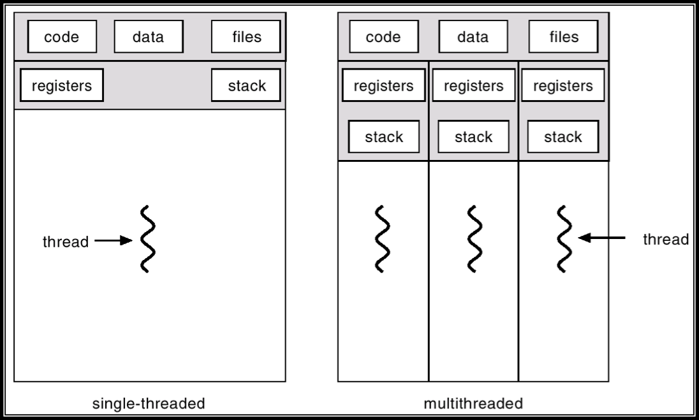
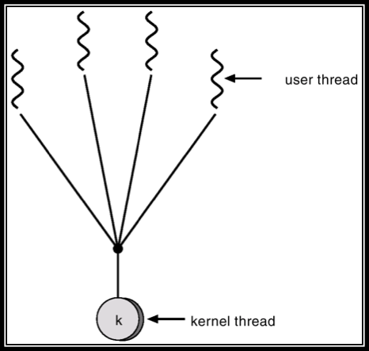
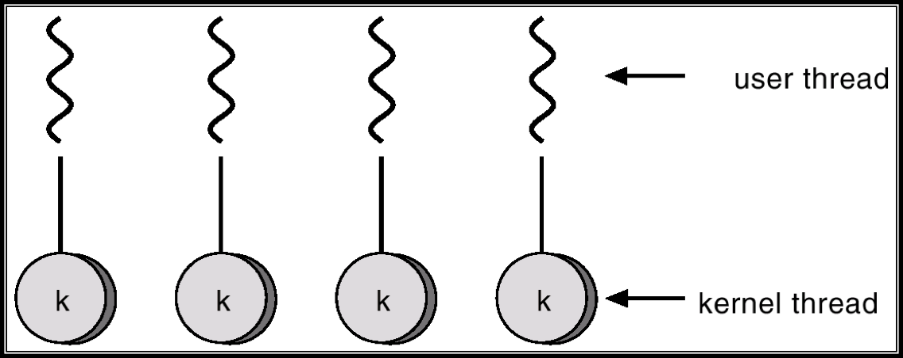
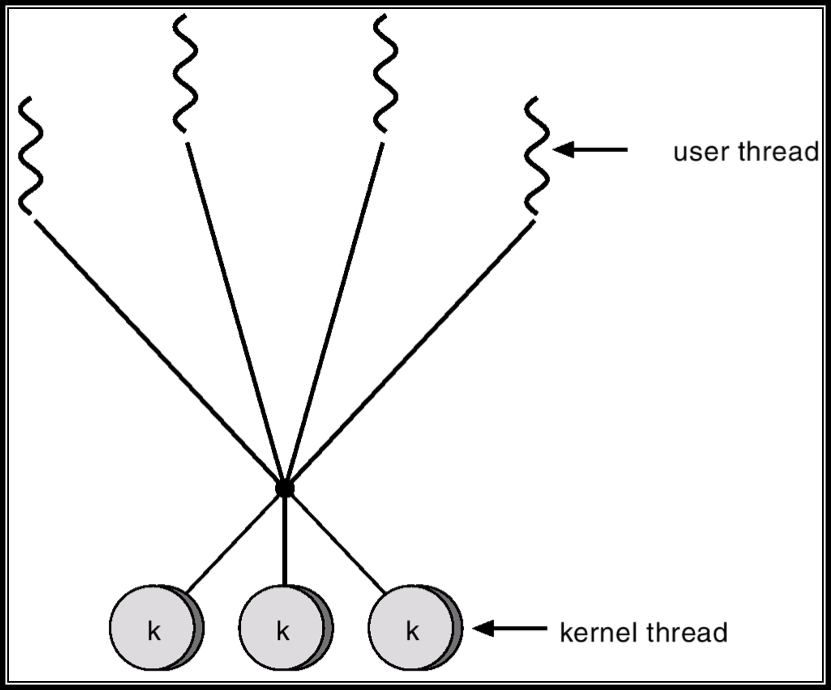

# 4장 스레드

## 4.1 나온 배경
- 하나의 실행 흐름을 나눠서 처리한다면 더 효율적일 것임.
- 스레드가 등장하기 전에는 새 작업에 새 프로세스를 생성하는 방식을 사용했지만 프로세스 생성은 시간이 많이 걸리고 많은 자원을 필요로 하는 오버헤드가 큼.
- 프로세스 간 협력의 경우 비용이 많이 들게 됨.

## 4.2 프로세스와 스레드
- 프로세스
  - 하나의 실행 흐름을 가짐.
  - Process 간의 memory는 독립적이므로 서로의 영역에 접근하기 어려움.(Protection Domain)
  - Process 간의 switch 비용이 상대적으로 큼.
- 스레드
  - 하나의 프로세스 안에 여러 개의 실행 흐름을 가짐.
  - 프로세스의 code 영역과 data 영역은 thread 간에 공유함.
  - 그래서 thread 간 switch 비용이 상대적으로 작음.

## 4.3 스레드의 구성요소
- 스레드는 프로세스와 마찬가지로 하나의 Execution Unit이기 때문에 실행과 관련된 자료 구조가 필요
  - Thread ID: 스레드 식별자
  - Program counter: 현재 실행중인 instruction 주소
  - Register set: CPU의 레지스터 값들
  - Stack: 함수 호출 시 전달되는 인자, 되돌아갈 주소값 및 함수 내에서 선언하는 변수 등을 저장.
- 레지스터와 스택은 독립적으로 가지고 존재함. **프로세스보다 스레드 고유의 정보가 적어 Switching 비용이 적음.**
- 동일 프로세스 내에 있는 다른 스레드와 공유하는 것
  - Code: 프로그램의 코드 부분.
  - Data: 프로세스의 데이터 부분.
  - File: 프로세스에서 open한 파일.

## 4.4 다중 스레드 프로그래밍

- 장점
  - Responsiveness(응답성): 다른 thread가 block되거나 시간이 걸리는 작업을 해도 다른 thread가 실행되고 있기 때문에 user의 입장에서 interactive함.
  - Resource sharing(자원 공유): thread 간의 프로세스 메모리와 다른 자원을 공유하기 때문에 IPC 같은 기법을 사용하지 않아도 됨.
  - Economy(경제성): thread는 하나의 프로세스 memory영역에서 실행하기 때문에 생성하고 문맥 교환하는 데에 비용이 적게 들어감.
  - Scalability(규모 적응성): 다른 processor에서 병렬적으로 스레드가 실행이 가능함.(parallelism)
- 다중 코어 프로그래밍
  - 최근의 경향은 하나의 칩 안에 여러 Computing core를 넣는 것.
  - 다중 스레드 프로그래밍은 다중 코어 시스템에서 더 효율적임.
    - 기존 단일 코어 시스템에서는 하나의 코어에 하나의 스레드만 실행시킬 수 있음. 그렇기 때문에 여기서의 병행성은 스레드의 실행이 시간에 따라 교대로 실행되는 것을 의미.
    - 다중 코어 시스템에서는 각 코어 당 스레드를 할당하여 병렬적으로 실행될 수 있다.
    - 다중 코어 시스템에서는 cache를 공유하기 때문에 data, code 등 프로세스의 자원을 공유하는 다중 스레드 프로그래밍에 보다 효과적임.
- CPU 2가지 이상의 실행 모드
  - System protection을 위해서 필요하며 각각의 실행 모드에 따라 권한(Privilege)이 달라져 접근할 수 있는 메모리, 실행 가능한 명령어가 제한됨.
  - 실행 모드를 나누려면 Hardware 지원이 필요하며 Intel은 ring이 0~3이기 때문에 4개를 지원할 수 있고 그 외는 2개를 지원한다.
  - User 모드에서 실행 중인 어플리케이션이 Kernel 모드의 지원이 필요한 경우 **'**실행 모드 전환**'** 을 행하는데 이 때 오버헤드가 발생한다.
  - User mode
    - Kernel 모드에 비해 낮은 권한의 실행 모드
    - 어플리케이션(사용자 응용 프로그램)이 실행됨.
    - Privilege 명령어는 실행이 불가.
  - Kernel mode
    - 모든 권한을 가진 실행 모드
    - 운영체제가 실행되는 모드
    - Privilege 명령어 및 레지스터에 접근이 가능(Ex: I/O 장치 제어 명령어, memory management register)
- User thread와 Kernel thread
  - 스레드를 지원하는 주체에 따라 나뉨.
  - User thread
    - 커널 영역 위에서 지원되며 user level의 라이브러리를 통해 구현되고 스케줄링과 관련된 관리를 해줌.
    - 장점: 동일한 메모리 영역에서 스레드가 생성, 관리되므로 속도가 빠름. **실행 모드의 전환이 없으므로 빠르다고 할 수 있다.**
    - 단점: Kernel은 여러 user 스레드를 하나의 프로세스로 간주하기 때문에 한 스레드가 시스템 호출로 인해 block되면 모든 thread가 block이 된다.
  - Kernel thread
    - 커널 영역에서 thread를 생성하고 스케줄링 등을 관리한다.
    - 장점: 한 스레드가 block이 되더라도 다른 스레드를 실행시켜 전체적인 thread blocking이 없다. 또한 다중 코어 환경에서 여러 스레드를 여러 코어에 할당 가능.
    - 단점: User 스레드보다 생성 및 관리가 느림. **실행 모드의 전환이 빈번하므로 느리다.**

## 4.3 다중 스레드 모델
- 유저와 커널 스레드 간의 연관 관계가 정립되어야 함.
- 다대일 모델(Many-to-One Model)
  - 여러 사용자 수준 스레드가 커널 스레드로 매핑.
  - 장점: 사용자 공간의 스레드 라이브러리에 의해 스레드 관리가 이루어져 효율적.
  - 단점: 한 번에 하나의 스레드만 커널에 접근 가능해 진정한 concurrency가 아님. 또한 여러 사용자 수준 스레드는 하나의 프로세스이기 때문에 다중 코어에서 동시에 수행이 불가능.
  - 이 모델은 거의 사용되지 않음.

  

- 일대일 모델(One-to-One Model)
  - 하나의 사용자 스레드와 하나의 커널 스레드를 매핑.
  - 장점: 다대일 모델에서 발견된 block 문제를 해결함.
  - 단점: 하나의 사용자 스레드가 생성되면 그에 맞춰 커널 스레드도 생성되기 때문에 생성 오버헤드가 발생하고 한정된 커널 자원임을 유의해야 함.
  - Windows나 Linux가 이 모델을 구현.

  
- 다대다 모델(Many-to-Many model)
  - 여러 개의 사용자 스레드와 같거나 그보다 적은 수의 커널 스레드를 매핑.
  - 다대일 모델의 block 문제나 일대일 모델의 수 제한을 해결.
  - 커널이 적절히 사용자 스레드와 커널 스레드의 매핑을 조절하여 위와 같은 장점을 보장.

  

## 4.5 Threading Issues
- Creation
  - 다중 스레드 프로그래밍에서 fork와 exec의 의미가 달라져야 함.
  - fork
    - 한 프로그램의 스레드가 fork를 호출하면 모든 스레드를 가진 프로세스를 만들 것인지, fork를 요청한 스레드만을 복사한 프로세스를 만들 것인지 생각해야함.
    - Linux에서는 2가지 버전의 fork로 이를 처리.
  - exec
    - fork를 하여 exec을 호출할 때 교체될 스레드들의 복사는 불필요한 작업일 것임.
    - 그래서 이 때는 fork를 요청한 스레드의 복사만을 하는 것이 바람직함.
    - 예외로 fork만 하고 exec을 하지 않는 경우에는 모든 스레드의 복사가 필요.
- Cancellation
  - 스레드 취소(Thread Cancellation): 스레드가 끝나기 전에 그 작업을 강제 종료 시키는 것.
  - 하나의 스레드가 자원을 가지고 있을 경우 할당된 자원을 함부로 해제하지 못함. 왜냐하면 다른 스레드가 그 자원을 사용하고 있을지도 모르기 때문임.

## 4.6 암묵적 스레딩
- 다중 스레드 프로그래밍이 다중코어 시스템의 성장, 수천 개의 스레드 응용이 등장하면서 어려워짐.
- 이를 해결하기 위해 **스레딩의 생성과 관리를 개발자로부터 컴파일러와 런타임 라이브러리에 넘겨주는 것**이 암묵적 스레딩이다.
- Thread Pool
  - 다중 스레드 환경에서 두 가지 문제가 존재.
    - 스레드가 자주 생성되고 제거되는 상황에서 생성하는 데 시간이 작업을 수행하는 시간보다 긴 경우가 존재.
    - 스레드는 시스템의 자원이기 때문에 자원의 한계를 고려해야함.
  - 해결책으로 스레드를 **미리 일정한 수의 스레드를 만들자!** -> 스레드 풀
  - 프로세스가 생성될 때 정해진 수의 스레드를 만들어 pool에 할당.
  - 스레드가 필요하면 pool에서 꺼내어 쓰고 끝나면 thread를 제거하지 않고 pool에 다시 넣어둠.
  - pool이 관리하는 스레드의 수는 시스템 환경이나 예상되는 작업에 따라 heuristic하게 결정.
- Grand Central Dispatch
  - Apple의 Mac OS X와 iOS 운영체제를 위한 기술로 C 언어, API 및 런타임 라이브러리 각각을 확장하여 조합함.
  - 개발자가 병렬로 실행될 수 있는 영역을 식별할 수 있게 도움을 줌.
  - GCD는 C와 C++ 언어를 확장한 **블록**(**block**)을 식별하는데 이 블록은 '**단순히 독립적으로 실행될 수 있는 작업의 단위**'를 말함.
  - GCD는 블록을 Dispatch Queue에 넣어서 실행될 수 있도록 하며 여기에는 직렬(Serial)과 병행(Concurrent) FIFO 방식의 두 가지의 디스패치 큐가 있다.
  - 큐에서 블록을 제거할 때 관리하고 있는 스레드 풀에서 가용 스레드를 선택하여 할당한다.
  - 직렬 큐는 한 번에 하나의 블록을 제거하며 다른 블록이 제거되기 전 실행을 완료해야 한다. 각 프로세스는 각작 직렬 큐, 메인 큐를 가짐.
  - 병렬 큐는 여러 블록이 동시에 제거될 수 있고 3가지 우선 순위의 큐가 제공된다.
