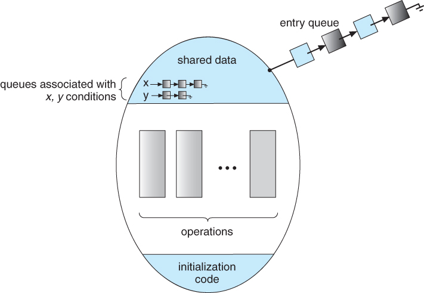

# 프로세스 동기화 Part 2

## 고전적인 동기화 문제들

### 유한 버퍼 문제 (The Bounded-Buffer Problem)

유한 버퍼 문제는 유한한 개수의 아이템을 삽입할 수 있는 버퍼에 여러 생산자와 여러 소비자가 접근하고자 할 때 발생할 수 있는 문제이다. 생산자와 소비자의 역할은 다음과 같다.

- 생산자
  - 하나의 아이템을 생산하여 버퍼에 저장
  - 버퍼 내에 공간이 있는지 확인하고 가득차있으면 대기
- 소비자
  - 버퍼로부터 하나의 아이템을 가져와서 소비
  - 버퍼 내에 가져올 아이템이 있는지 확인하고 없으면 대기

여러 생산자가 존재한다고 할 때 하나의 빈 공간에 두 생산자가 동시에 접근하려고 하면 둘 중 하나의 데이터는 유실될 가능성이 있다. 또 여러 소비자가 있을 때에도 하나의 데이터에 두 소비자가 동시에 접근하려고 한다면 하나의 데이터를 두 소비자가 모두 가져가게 되는 문제가 발생할 수 있다. 이러한 문제는 이진 세마포어(binary semaphore)를 사용하여 락을 걸어서 해결할 수 있다.

버퍼 내의 공간이 유한하다는 제약에서 비롯되는 문제가 남아있다. 생산자는 아이템을 버퍼에 추가하기 전에 우선 빈 공간을 획득하려는 시도를 통해 빈 공간이 있는지 확인해야 한다. 마찬가지로 소비자는 채워진 아이템을 획득하려는 시도를 통해 채워진 아이템이 있는지 확인해야 한다. 획득하지 못하면 대기한다.

동기화 변수와 초기화
- semaphore full
  - 채워져 있는 공간의 수
  - 0으로 초기화
- semaphore empty
  - 비어있는 공간의 수
  - n으로 초기화
- semaphore mutex
  - 버퍼에 대한 접근을 관리하는 이진 세마포어
  - 1로 초기화

생산자 프로세스와 소비자 프로세스는 순서대로 아래와 같다. 둘의 코드 흐름이 대칭적인 것이 특징이다.

```c
do {
  // 아이템을 하나 생산한다

  P(empty); // 빈 공간 획득 시도
  P(mutex); // lock

  // 아이템을 버퍼에 추가한다

  V(mutex); // unlock
  V(full); // 버퍼 내에 아이템이 채워졌음을 있음을 알림
} while (TRUE)
```

```c
do {
  P(full); // 채워진 아이템 획득 시도
  P(mutex); // lock

  // 버퍼로부터 아이템을 하나 제거한다

  V(mutex); // unlock
  V(empty); // 버퍼 내에 빈 공간이 생겼음을 알림

  // 아이템을 소비한다
} while (TRUE)
```

### Readers-Writers 문제 (The Readers-Writers Problem)

여러 reader들과 writer들이 하나의 공유 데이터에 읽거나 쓰기 위하여 접근할 때 발생하는 문제이다. reader는 여럿이 동시에 공유 데이터에 접근하여 읽어도 문제가 되지 않는다. 그러나 writer의 경우에는 한 번에 하나의 writer만 쓰기를 수행할 수 있으며, 이 때는 reader들 또한 공유 데이터에 접근하고 있어서는 안된다.

동기화 변수와 초기화
- readcount
  - DB에 현재 접근 중인 reader의 수
  - 0으로 초기화
- wrt
  - writer들 사이의 동기화 관리
  - 1로 초기화
- mutex
  - readcount와 wrt로의 접근이 원자적으로 수행되도록 보장하는 세마포어
  - 1로 초기화

다음은 차례대로 writer와 reader 프로세스의 코드이다.

```c
do {
  P(wrt);

  // 쓰기 수행

  V(wrt);
} while (TRUE)
```

```c
do {
  P(mutex);
  readcount++;
  if (readcount == 1)
    P(wrt);
  V(mutex);

  // 읽기 수행

  P(mutex);
  readcount--;
  if (readcount == 0)
    V(wrt);
  V(mutex);
} while (TRUE)
```

reader 프로세스의 특징은 readcount 또한 공유 데이터이기 때문에 증감 전후로 lock과 unlock을 수행한다는 점이다. 그리고 0으로 초기화된 readcount를 최초로 1로 증가시키면서 if문에 의해 writer는 block된다. 이후의 다른 reader들이 추가적으로 접근하여도 허용한다. 시간이 지나 reader들 더 이상 접근하지 않아 readcount가 0이 되면 writer의 block을 해제하여 쓰기가 허용되도록 한다.

writer 프로세스 자체는 간단한 구조이지만, reader 프로세스 때문에 writer는 기아의 발생 가능성을 가진다. 최초에 한 번 reader에 공유 데이터에 접근하고 이어서 reader들이 계속 접근한다면 writer는 무한히 기다리다가 기아가 될 수 있다.

### 식사하는 철학자들 문제 (The Dining-Philosophers Problem)

생각하거나 식사하거나 둘 중에 하나만 하는 철학자 다섯이 모여 식사를 한다. 철학자들 사이에 젓가락 한 짝이 하나 씩 총 5개 있고 젓가락 사용 규칙은 다음과 같다.

- 자신의 바로 좌우의 젓가락만 집을 수 있다.
- 두 젓가락을 모두 집어야 식사를 할 수 있다.
- 식사를 하고 난 다음에 두 젓가락을 모두 내려놓는다.

만약 다섯 모두 오른쪽 젓가락을 동시에 든다면 교착상태와 기아가 발생할 것이다. 교착상태를 해결하기 위하여 다음의 해결안들을 생각해 볼 수 있다. 그렇지만 교착상태를 해결한다고 하여 반드시 기아를 피할 수 있는 것은 아니다. 교착상태는 회피하여 식사가 진행되도록 할 수는 있으나 한 철학자만 식사를 못하여 굶어 죽을 가능성은 여전히 남아있다는 뜻이다.

- 한 번에 최대 4명의 철학자만 식탁에 앉을 수 있도록 제한한다.
- 젓가락 상태 검사를 통해 양 쪽의 젓가락이 모두 사용 가능할 때만 젓가락을 집도록 한다.
- 홀수인 철학자는 왼쪽의 젓가락을, 짝수인 철학자는 오른쪽의 젓가락을 먼저 집도록 한다.

이 문제에 대한 자세한 해법은 다음 절에서 모니터를 알아본 다음 제시한다.

## 모니터

프로그래머가 세마포어를 직접 사용하는 데에는 다음의 문제들이 있다. 간단히 말해 세마포어를 사용하여 임계 영역을 해결하고자 할 때 프로그래머가 자칫 잘못하면 치명적인 오류가 쉽게 발생할 수 있다는 것이다.

- 코딩하는 것이 힘들다.
- 정확성(correctness) 입증이 어렵다.
- 자발적 협력(voluntary cooperation)이 필요하다.
- 한 번의 실수가 시스템 전체에 치명적으로 영향을 미친다.

이 문제를 해결하기 위하여 모니터를 도입할 수 있다. 모니터는 고급 언어에서 제공하는 하나의 자료형으로서, 모니터의 내부에는 공유 데이터와 상호배제를 보장하기 위한 procedure들, 초기화 코드 등으로 구성되어 있다.



```c
  monitor monitor_name {
    // 공유 데이터 변수 선언

    procedure P1(...) {
      ...
    }
    procedure P2(...) {
      ...
    }
    procedure Pn(...) {
      ...
    }

    // 초기화 코드
  }
```

모니터를 사용하면 다음과 같은 이점을 얻을 수 있다.
- 한 순간에 하나의 프로세스만 수행되는 것이 보장된다.
- 동기화 제약조건(P와 V 연산)을 프로그래머가 명시적으로 코딩할 필요가 없이, procedure를 호출하는 것으로 대체할 수 있다.

그리고 공유 자원의 여분이 없는 경우에 프로세스들을 큐에 차례대로 넣어 모니터 안에서 기다리도록 하기 위하여 condition 변수를 사용한다. 이 변수는 wait과 signal 연산에 의해서만 접근이 가능하다.
- `condition x, y`
- `x.wait()`: signal이 호출될 때까지 프로세스를 suspend시킨다.
- `x.signal()`: suspend된 프로세스를 resume한다.

### 적용: 식사하는 철학자들 문제

모니터를 적용한 해법에서는 두 가지 공유 데이터가 필요하다.

- enum {THINKING, HUNGRY, EATING} state[5]
  - 철학자의 상태 변수
- condition self[5]
  - 철학자가 젓가락 두 개를 동시에 잡을 수 있는지 변수
  - 잡을 수 없다면 wait()가 호출되어 자기 큐로 들어가 signal()이 호출될 때까지 대기

모니터의 구현은 다음과 같다.

```c
monitor DiningPhilosophers {
  enum {THINKING, HUNGRY, EATING} state [5];
  condition self[5];

  void pickup(int i) {
    state[i] = hungry;
    test(i);
    if (state[i] != eating)
      self[i].wait(); // 자기 큐에 들어가서 잠듦
  }

  void putdown(int i) {
    state[i] = thinking;
    test((i + 4) % 5); // 식사를 끝내고 인접 철학자들이 먹을 수 있는지 확인
    test((i + 1) % 5);
  }

  void test(int i) { // 젓가락 두 개를 잡을 수 있는지 확인
    if ((state[(i + 4) % 5] != eating) // 왼쪽 철학자 먹지 않지 않다면
      && (state[i] == hungry) // 자신이 배고파 한다면
      && (state[(i + 1) % 5] != eating)) {  // 오른쪽 철학자 먹지 않다면
        state[i] = eating;
        self[i].signal(); // 자신이 잠들어 있을 경우에 깨워줌
    }
  }

  initialization_code() {
    for (int i = 0; i < 5; i++)
      state[i] = thinking;
  }
}
```

각 철학자들은 다음과 같이 행동한다.

```c
do {
  pickup(i)
  // eat
  putdown(i);
  // think
} while (TRUE)
```

----

#### References
* Operating System Concepts (8th Edition), Abraham Silberschatz, 홍릉과학출판사
* [[강의] 운영체제, 반효경, 이화여자대학교, 2017 - KOCW](http://www.kocw.net/home/search/kemView.do?kemId=1226304)
