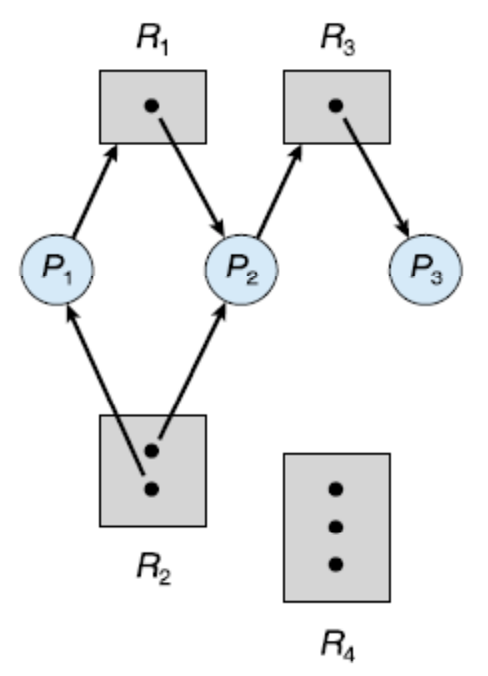
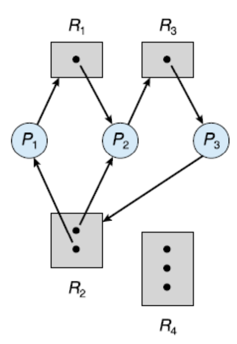
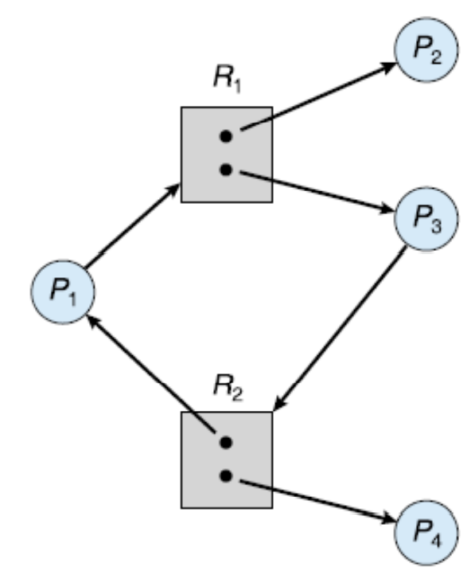

# 교착상태(Deadlocks)
대기 중인 프로세스들이 서로 점유하고 있는 자원을 요청해 그 상태를 벗어나지 못할 때 그것을 `교착상태`라고 한다. 보통 운영체제는 교착상태를 예방하는 기능을 제공하지 않기 때문에 교착상태를 막는 것은 전적으로 프로그래머의 책임이다. 더 많은 프로세스, 스레드, 자원을 사용하는 요즘 추세에서는 교착상태가 더더욱 일상적인 문제가 될 것이다.

## 시스템 모델(System Model)
시스템은 경쟁하는 프로세스들 사이에 분배되어야 할 유한한 수의 자원들로 구성된다. 이들 자원은 다수의 타입으로 분할되며, 각각의 자원은 인스턴스로서 존재한다. 예를 들어 CPU 같은 경우 시스템이 두 개의 CPU를 가진다면 두 개의 인스턴스를 가지는 셈이 된다.

프로세스는 작업을 수행하기 위해 자원을 사용하는 데 정상적인 작동 모드 하에서 다음 과정을 거친다.

1. 요청: 프로세스는 자원을 요청한다. 요청이 즉시 허용되지 않으면(예: 다른 프로세스가 그 자원을 점유하고 있는 경우) 자원을 얻을 때까지 대기해야 한다.
2. 사용: 프로세스는 자원에 대해 작업을 수행할 수 있다.
3. 방출: 프로세스가 자원을 방출한다.

자원의 요청과 방출은 장치의 `request()`와 `release()`, 파일의 `open()`과 `close()`, 메모리의 `allocate()`와 `free()` 같은 시스템 호출로 이루어진다. 프로세스나 스레드가 커널의 자원을 사용할 때마다 운영체제는 자원의 요청/할당 여부를 기록한다.

한 프로세스 집합 내의 모든 프로세스가 그 집합 내의 다른 프로세스에 의해서만 발생될 수 있는 사건을 기다린다면, 그 프로세스 집합은 교착상태에 있다. 이 때 우리의 주 관심 사건은 자원의 획득과 방출이며 자원에는 물리적 자원(프린터, CPU 주기, 메모리 공간)과 논리적 자원(세마포, mutex 락, 파일)을 포함한다.

## 교착상태의 특징(Deadlock Characterization)

### 필요조건들(Necessary Conditions)
교착상태는 다음 네가지 조건이 동시에 성립할 때 발생할 수 있다.

1. 상호 배제(Mutual exclusion): 한 번에 하나의 프로세스만이 자원을 사용할 수 있다. 다른 프로세스가 점유되고 있는 자원을 요청할 경우 방출될 때까지 반드시 대기해야 한다.
2. 점유하며 대기(Hold-and-wait): 프로세스는 최소한 하나의 자원을 점유한 채, 현재 다른 프로세스에 의해 점유된 자원을 추가로 얻기 위해 반드시 대기해야 한다.
3. 비선점(No preemption): 자원들을 선점할 수 없어야 한다. 즉, 자원이 강제적으로 방출될 수 없고, 점유하고 있는 프로세스가 자발적으로 방출하는 것만 허용된다.
4. 순환 대기(Circular wait): 프로세스끼리 순환적으로 대기하는 경우를 말한다. 예를 들어 프로세스 *P0* 가 *P1* 이 점유한 자원을 대기하고, *P1* 이 *P2* 가 점유한 자원을 대기하고, *P2* 가 *P0* 가 점유한 자원을 대기할 때를 말한다.

위의 네 조건은 완전히 독립적인 것은 아니지만 교착상태 예방을 위해서는 별개로 보는 것이 유용하다.

### 자원 할당 그래프(Resource-Allocation Graph)
교착 상태를 보다 정확하게 기술할 수 있는 그래프로 정점(vertex) *V*의 집합과 간선(edge) E의 집합으로 구성된다.

정점 *V*의 집합은 두 가지 타입으로 구별된다.
- 시스템 내의 모든 **활성 프로세스** 의 집합 *P* = {*P1*, *P2*..., *Pn*}
- 시스템 내의 모든 **자원 타입** 의 집합 *R* = {*R1*, *R2*..., *Rm*}

방향 간선(directed edge)도 그 방향에 따라 두 가지로 나뉘어 진다.
- *Pi* -> *Rj* 의 방향 간선은 **요청 간선(request edge)** 라 부른다.
- *Rj* -> *Pi* 의 방향 간선은 **할당 간선(assignment edge)** 라 부른다.

프로세스가 자원을 요청하면 요청 간선이 자원 할당 그래프 안에 삽입되는데 이 때 가용 자원이 있으면 할당 간선으로 변환된다.

그래프가 사이클을 포함하지 않으면 어느 프로세스도 교착상태가 아니라고 말할 수 있지만 사이클을 포함한다면 교착상태가 **존재할 수도 있다.** 만약 각 자원 타입이 하나의 인스턴스만 가진다면 교착 상태가 발생하였다는 것을 알려준다. 그러나 여러 인스턴스가 존재하는 경우 사이클이 반드시 교착상태를 의미하지는 않는다.

예를 들어 다음 그림을 보자.

다음 그림을 보면 두 개의 사이클이 존재한다는 것을 알 수 있다.
- *P1* -> *R1* -> *P2* -> *R3* -> *P3* -> *R2* -> *P1*
- *P2* -> *R3* -> *P3* -> *R2* -> *P2*

위의 세 프로세스는 교착 상태로 서로가 점유한 자원을 대기하고 있는 상태로 교착상태이다.

그런데 다음 그림을 보자.

다음 그림에서도 사이클을 발견할 수 있다.
- *P1* -> *R1* -> *P3* -> *R2* -> *P1*

하지만 *R1* 의 자원은 *P2* 가, *R2* 의 자원은 *P4* 가 방출할 가능성도 있므으로 그 때는 사이클이 없어진다.

이러한 관찰은 우리가 교착상태를 다루는 데 중요하다.

## 교착상태 처리방법(Methods of Handling Deadlocks)
원칙적으로 교착상태 문제를 처리하는 데는 세 가지 방법이 있다.
- 시스템이 결코 교착상태가 되지 않도록 **예방**하거나 **회피**하는 프로토콜을 사용.
- 시스템이 교착상태가 되도록 허용한 다음 **회복**시키는 방법.
- 문제를 **무시**하고, 교착상태가 시스템에서 결코 발생하지 않는 척하기.

위 방법 중 세 번째 방법이 Linux와 Windows를 포함해 가장 많이 쓰이는 방법이며 이는 **비용**적인 측면을 고려한 것이다.

## 교착상태 예방(Deadlock Prevention)
교착상태가 발생하는 네 가지 조건 중 최소한 하나가 성립되지 못하게 함으로써 예방하는 방법이다. 네 가지 조건들을 각각 검토해보자.

### 상호 배제(Mutual Exclusion)
일반적으로 상호 배제 조건을 거부함으로써 교착상태를 예방하는 것은 불가능하다. 읽기-전용 파일 같은 공유 가능한 자원은 배타적인 접근을 요구하지 않아 교착상태와 관련되지 않지만 mutex 락 같은 자원은 근본적으로 공유가 불가능하다.

### 점유하며 대기(Hold and Wait)
이 조건을 막으려면 프로세스가 자원을 요청할 때 점유하고 있는 자원이 없음을 우리가 반드시 보장해야 한다. 여기에는 두 가지 프로토콜이 있다.
- 각 프로세스가 실행되기 전에 자신이 필요한 모든 자원을 요청하고 할당받을 것을 요구. 우리는 한 프로세스를 위해 자원을 요청하는 시스템 호출이 모든 시스템 호출보다 앞서도록 하여 구현할 수 있음.
- 자원을 갖고 있지 않을 때만 자원을 요청할 수 있게끔 함.

위의 방법들에는 두 가지 중요한 단점이 존재한다.
1. 이용도가 낮음: 많은 자원들이 할당된 후 오랫동안 사용되지 않기 때문에 자원의 이용도가 낮을 수 있다.
2. 기아 상태가 가능: 자주 쓰이는 자원을 필요로 하는 프로세스의 경우 할당을 못 받아 무한정 대기할 수도 있다.

### 비선점(No Preemption)
이 조건이 성립하지 않기 위해 우리는 다음의 방법을 사용할 수 있다.
- 점유하고 있는 자원을 요청할 경우 한 프로세스가 그 자원을 점유하고 있더라도 방출함.
- 한 프로세스가 자원을 요청했을 때 사용이 불가능 하면, 그 자원을 점유하고 있되 작업을 위해 추가적인 자원을 대기하고 있는 프로세스한테서 뺏어와 할당한다. 만약 그렇지 않다면 대기해야 한다.

위의 방법들은 CPU 레지스터나 메모리 공간처럼 그 상태가 쉽게 저장되고 복원이 가능한 자원의 경우에 종종 적용되며 일반적으로 mutex나 세마포어 같은 자원에는 적용될 수 없다.

### 순환 대기(Circular Wait)
순환 대기 조건이 성립되지 않는 한 가지 방법은 모든 자원 타입들에게 전체적인 순서를 부여하여 각 프로세스가 열거된 순서대로 오름차순으로 자원을 요청하도록 요구하는 것이다.

예를 들어 자원 타입의 집합 *R* = {*R1*, *R2*..., *Rm*}이 있을 때 각 프로세스는 오름차순으로만 자원을 요청할 수 있도록 한다. 일대일 함수인 *F*: *R* -> *N*(자연수의 집합)는 순서를 나타내는 자연수를 반환한다고 하자. 그러면 프로세스는 *F*(*R**j*) > F(*R**i*)를 만족할 때만 자원 *R**j*의 인스턴스를 요청할 수 있다. 순서대로 요청할 수 있다는 의미이다.

다른 대안으로는 프로세스가 자원 타입 *R**j*을 요청할 때마다 *F*(*R**j*) <= F(*R**i*)인 모든 자원 *R**i*을 방출하도록 요구하는 방법이 있다. 즉, 상위 순서의 자원을 모두 토해내야 한다는 것이다.

위의 두 프로토콜에서 또 유의할 점은 동일한 유형의 자원을 여러 개 할당받을 경우 단 한번의 요청으로 받아야 한다는 점이다. 이 두 프로토콜은 순환 대기 조건이 발생하지 않으며 이것은 순환대기가 발생한다고 가정하는 귀류법으로 증명이 가능하다.

> *cf) 순서나 계층 구도를 정하는 것 자체만으로 교착상태를 예방할 수 없고 그것을 지키는 프로그램을 짜는 것은 온전히 프로그래머의 몫이다. 또한 자원이 사용되는 정상적인 순서를 고려해 순서를 짜야한다.*

## 교착상태 회피(Deadlock Avoidance)
교착상태를 예방하는 방법은 요청에 제한을 두어 교착상태가 이루어지는 네 가지 조건 중 최소 하나를 막는 방법이다. 하지만 이 방법의 중요한 단점은 장치의 `이용률`이 저하되고 `시스템 처리율(throughput)`이 감소된다는 점이다.

만약 '자원이 어떻게 요청될 지 미리 파악하고 그에 따른 알고리즘을 짤 수 있다면?'하는 생각에서 비롯된 것이 `교착상태 회피`이다. 각 프로세스의 요청과 방출에 대한 완전한 순서를 파악하고 있다면 우리는 각 요청에 대해서 가능한 미래의 교착상태를 피하기 위해 프로세스가 대기해야 하는지 여부를 결정할 수 있다.

### 안전 상태(Safe State)
시스템 상태가 안전하다는 말은 `시스템이 어떤 순서로든 프로세스들이 요청하는 모든 자원을 교착상태를 야기시키지 않고 차례로 모두 할당해 줄 수 있는 상태`를 말한다. 즉, **안전 순서(safe sequence)** 를 찾아야 한다. 안전 순서란 어떤 프로세스 *P**i*에 대해 그 *P**i*가 요청하는 자원을 시스템에 현재 남아있는 자원과 앞에서 수행을 마칠 모든 프로세스 *P**j*(*j* < *i*)들이 반납하는 자원들로 만족시켜 줄 수 있음을 뜻한다.

시스템이 안전하다는 것은 교착상태가 없다는 것을 의미한다. 그러나 시스템이 불안전하다고 항상 교착상태로 빠진다는 것은 맞지 않다. 교착상태로 언제든지 빠질 수 있는 가능성을 내포하고 있으며 이는 프로세스들의 행동 양태에 따라 달라진다.

또한 시스템은 안전 상태에서 불안전 상태로 언제든지 빠질 수 있다. 그러므로 프로세스가 자원을 요청할 때 바로 들어줄지, 미루고 기다리게 해야 할지를 결정해야 한다. 이 때문에 자원의 이용률은 회피를 쓰지 않을 때보다 낮아질 수 밖에 없다.

### 자원 할당 그래프 알고리즘(Resource-Allocation Graph Algorithm)
기존의 자원 할당 그래프에 `예약 간선(claim edge)`을 추가하여 하는 방법으로 기존의 그래프에 프로세스가 실행되기 전 예약 간선을 점선으로 표시하여 요청 간선이 될 것을 명시해 해두는 것이다. 즉, 프로세스가 어떠한 요청을 할 것인지 미리 알아야 한다.

요청을 받으면 우리는 사이클 탐지(cycle detection) 알고리즘을 이용해 사이클이 발생하지 않을 때만 요청을 허용해야 한다. 사이클이 없다면 자원을 할당해도 시스템이 안전 상태겠지만 만약 사이클이 발견된다면 시스템을 불안전 상태로 만들 것이다. 사이클 탐지 알고리즘은 O(*n*2)의 시간이 걸리며 여기서 *n*은 그래프에 있는 정점(프로세스)의 수이다.

### 은행원 알고리즘(Banker's Algorithm)
자원 할당 그래프 알고리즘은 자원의 인스턴스가 하나만 있을 때만 사용이 가능하지만 은행원 알고리즘은 사용이 가능하다. 그러나 효율성은 보다 떨어진다는 단점이 있다.

이 시스템에서는 프로세스가 시작하기 전 프로세스가 가지고 있어야 할 자원의 최대 갯수를 자원 종류마다 미리 신고해야 한다. 프로세스가 자원을 요청할 때 시스템은 그것을 들어주었을 때 시스템이 계속 안전한 상태에 머무르는지 판단하고 프로세스가 대기를 해야하는지 아닌지 결정한다.

은행원 알고리즘을 구현하기 위해 몇 가지 자료구조가 필요하다. *n*이 프로세스의 갯수이고 *m*이 자원의 종류라고 하자.
- Available: 각 종류 별로 가용한 자원의 갯수를 나타내며 크기가 m이다. *Available*[*j*] = *k*라면 *R**j*를 *k*개 사용할 수 있다는 뜻이다.
- Max: 각 프로세스가 최대로 필요로 하는 자원의 갯수를 나타내는 행렬로 크기가 *n* X *m*이다. *Max*[*i*,*j*] = *k*라면 *P**i*가 *R**j*를 최대 *k*까지 요청할 수 있음을 나타낸다.
- Allocation: 각 프로세스에게 현재 할당된 자원의 갯수를 나타내는 행렬. 크기가 *n* X *m*이며  *Allocation*[*i*,*j*] = *k*라면 현재 *P**i*가 *R**j*를 *k*개 사용 중임을 뜻한다.
- Need: 각 프로세스가 향후 요청할 수 있는 자원의 갯수를 나타내는 행렬. 크기가 *n* X *m*이며 *Need*[*i*,*j*] = *k*라면 향후 *R**j*를 *k*개 더 요청할 수 있음을 뜻한다. *Need*[*i*,*j*] = *Max*[*i*,*j*] - *Allocation*[*i*,*j*] 관계가 있음을 알 수 있다.

위의 자료구조는 시간이 흐름에 따라 변하며 *X* <= *Y*인 경우 모든 *i*에 대해 *X*[*i*] <= *Y*[*i*]의 관계가 있다는 것을 뜻한다. 이는 *X*의 모든 원소가 각각의 대응되는 *Y*의 원소보다 작거나 같다는 의미이다. 예) *X* = (0, 3, 2, 1), *Y* = (1, 7, 3, 2)

또한 *Allocation*과 *Need* 행렬의 각 row를 vector로 취급하고 이들 row vector들은 *Allocationi*, *Need**i*와 같이 표기한다.

#### 안전성 알고리즘(Safety Algorithm)
시스템이 안전한지 아닌지 알아내는 알고리즘이다.
1. *Work*와 *Finish*는 크기가 *m*과 *n*인 벡터이다. *Work* = *Available*로 초기 값을 주며 *i* = 0, 1, ..., n - 1에 대해 *Finish*[*i*] = *false*를 초기 값을 준다.
2. 아래 두 조건을 만족시키는 *i* 값을 찾는다.
  - *Finish*[*i*] == *false*
  - *Need**i* <= *Work*

  그러한 *i* 값을 찾을 수 없다면 4단계로 간다.

3. - *Work* = *Work* + *Allocationi*
   - *Finish*[*i*] = *true*

    2단계로 간다.
  
4. 모든 *i* 값에 대해 *Finish*[*i*] == *true*이면 이 시스템은 안전 상태이다.

이 알고리즘으로 안전 여부를 알아내는 데에는 *m* X *n*2 개의 연산이 필요하다.

#### 자원 요청 알고리즘(Resource-Request Algorithm)
자원 요청이 안전하게 들어줄 수 있는지 검사하는 알고리즘이다.

*Request**i*는 프로세스 *P**i* 의 요청 vector임을 뜻한다.
1. If *Requesti* <= *Needi* 라면 2단게로 간다.그렇지 않으면 시스템에 있는 갯수보다 더 많은 요청을 했으므로 오류로 처리.
2. If *Requesti* <= *Available* 이면 3단계로 간다. 아니면 가용 자원이 아직 부족하므로 *P**i*는 대기해야 한다.
3. 시스템이 *Pi* 에게 자원을 할당한 것처럼 시스템의 상태 정보를 다음과 같이 꾸며본다.
  - *Available* = *Available* - *Requesti*
  - *Allocationi* = *Allocationi* + *Requesti*
  - *Needi* = *Needi* - *Requesti*

  이 상태에서 안전성 알고리즘을 통해 시스템이 안전하다면 요청을 받아들여 자원을 할당한다. 그러나 만약 불안전하다면 *Pi* 는 요청이 만족될 때까지 대기해야 한다.

## 교착상태 탐지(Deadlock Detection)
시스템이 교착상태 예방이나 방지 알고리즘을 사용하지 않는다면 시스템은 다음 알고리즘을 반드시 지원해야 한다.
- 교착상태 탐지 알고리즘
- 교착상태 회복 알고리즘

우리는 탐지 알고리즘에서 필요한 정보 유자와 실행 시간의 비용, 그리고 교착상태로부터 회복할 때 내재하는 가능한 손실을 포함하는 **오버헤드**가 뒤따른다는 것에 주목해야 한다.

### 각 자원 타입이 하나씩 있는 경우(Single Instance of Each Resource Type)
모든 자원들이 한 개의 인스턴스만 있다면, **대기** 그래프(wait-for graph)를 사용해 교착상태 탐지 알고리즘을 적용할 수 있다. 자원 할당 그래프에서 자원 노드를 빼고 대기하는 간선만으로 그린 그래프로 앞에서와 마찬가지로 사이클이 존재하는 경우에만 시스템에 교착 상태가 존재한다.

교착 상태를 탐지하기 위해 시스템은 그래프를 유지해야하고 주기적으로 그래프에서 사이클을 탐지하는 알고리즘을 호출한다. 사이클 탐지는 마찬가지로 O(*n*2)의 시간이 걸리며 여기서 *n*은 그래프에 있는 정점(프로세스)의 수이다.

### 각 자원 타입이 여러 개 존재하는 경우(Several Instance of a Resource Type)
여러 개가 존재하는 경우 대기 그래프 대신 은행원 알고리즘과 비슷한 알고리즘을 사용한다. 자료구조는 은행원 알고리즘과 같이 시시각각 달라지는 알고리즘을 적용한다.
- Available: 각 종류의 자원이 현재 몇 개 가용한지를 나타냄. 크기는 *m*.
- Allocation: 각 프로세스에 현재 할당되어 있는 자원의 갯수를 나타내는 행렬. 크기는 *n* X *m*.
- Request: 각 프로세스가 현재 요청 중인 자원의 갯수를 나타내는 행렬로 크기는 *n* X *m*.

1. *Work*와 *Finish*는 크기가 *m*과 *n*인 벡터이다. *Work* = *Available*로 초기 값을 주며 *i* = 0, 1, ..., n - 1에 대해 *Allocationi* != 0이면 *Finish*[*i*] = *false*를, 아니면 *true*를 준다.
2. 아래 두 조건을 만족시키는 *i* 값을 찾는다.
  - *Finish*[*i*] == *false*
  - *Requesti* <= *Work*

  그러한 *i* 값을 찾을 수 없다면 4단계로 간다.

3. - *Work* = *Work* + *Allocationi*
   - *Finish*[*i*] = *true*

    2단계로 간다.
  
4. 어떠한 *i* 값에 대해(0 <= *i* <= *n*) *Finish*[*i*] == *false*이면 이 시스템은 교착 상태이고 *P**i*도 마찬가지이다.

은행원 알고리즘과 같이 *m* X *n*2 개의 연산이 필요하다.

### 탐지 알고리즘 사용(Detection-Algorithm Usage)
탐지 알고리즘을 언제 돌리느냐는 다음 두 관점에 달려있다.
- 교착상태가 얼마나 **자주** 일어나는가?
- 교착상태가 일어나면 통상 **몇 개**의 프로세스가 거기에 연루되는가?

교착상태가 자주 일어난다면 더 자주 돌려야 할 것이고, 시간이 더 경과하면 더 많은 프로세스가 교착상태에 연루될 것이다. 만약 극단적으로 프로세스의 요청이 즉시 만족되지 못할 때마다 탐지 알고리즘을 돌린다면 연루된 프로세스와 교착상태를 야기한 장본인까지 알아낼 수 있다. 그러나 오버헤드가 너무 클 것이다. 또한 임의의 시간, 예를 들어 CPU 이용률에 따라 탐지를 한다고 하면 장본인은 알아낼 수 없게 된다.

## 교착상태로부터 회복(Recovery from Deadlock)
교착상태가 존재하는 것을 탐지하면 처리하는 방법에는 두 가지가 있다.
- 운영자에게 통지해 처리하게 하는 방법
- 시스템이 자동적으로 교착상태로부터 회복하는 방법

또한 교착상태를 깨뜨리는 방법도 두 가지가 있다.
- 순환 대기를 깨뜨리기 위해 단순히 한 개 이상의 프로세스를 **중지(abort)** 시키는 방법
- 교착상태에 있는 하나 이상의 프로세스들로부터 자원을 **선점(preempt)** 하는 방법

### 프로세스 종료(Process Termination)
프로세스 중지에는 두 가지 방법이 있으며 두 방법 모두 할당되었된 자원은 시스템이 회수한다.
- 교착상태 프로세스를 모두 중지: 확실하게 교착상태를 깨뜨릴 수 있지만 비용이 크다. 그동안의 작업을 모두 날려야 하기 때문.
- 교착상태가 제거될 때까지 하나씩 중지: 각 프로세스를 중지할 때마다 교착상태 탐지 알고리즘을 돌려야 하기 때문에 상당한 오버헤드를 유발한다.

만약 하나씩 중지하는 방식을 사용한다면 종료하는데 들어가는 비용이 가장 적은 프로세스를 선택하여 행해야 한다. 다음과 같은 고려 사항이 있다.
- 프로세스의 우선순위가 무엇인지
- 지금까지 프로세스가 수행된 시간과 지정된 일을 종료하는 데 필요한 시간
- 프로세스가 사용한 자원 타입과 수
- 프로세스가 종료하기 위해 더 필요한 자원의 수
- 얼마나 많은 수의 프로세스가 종료되어야 하는지
- 프로세스가 대화형(interactive)인지 일괄처리(batch)인지 여부

### 자원 선점(Resource Preemption)
교착상태가 깨질 때까지 자원을 선점하여 다른 프로세스에 주어야 한다. 만일 자원 선점 방법을 사용한다면 다음 세 가지 사항을 고려해야 한다.
- 희생자 선택(selection of a victim): 프로세스 종료와 마찬가지로 최소 비용이 드는 프로세스로부터 자원을 선점해야 한다. 비용 요인으로는 교착상태 프로세스가 점유한 자원의 수, 지금까지 실행 소요 시간 등이 있다.
- 후퇴(rollback): 프로세스로부터 자원을 선점하려면, 그 프로세스의 진행중인 작업은 후퇴시켜야 할 것이다. 가장 철저한 방법은 아예 종료시키는 것이지만 교착상태를 깨뜨릴 수 있을 정도로만 후퇴시키는 것이 더 효율적일 것이다. 하지만 이 방법을 적용하려면 모든 프로세스에 대한 상태 정보를 유지해야 한다는 오버헤드가 뒤따른다.
- 기아 상태(starvation): 비용 요인으로 희생자를 선택하는 방법을 따르면 어쩌면 동일한 프로세스가 계속 희생자로 선택되어 기아 상태에 이를 수 있다. 그러므로 우리는 한정된 시간 동안만 희생자로 선택된다는 것을 보장해야 한다. 예를 들어 비용 요소에 후퇴의 횟수를 포함시켜 계산하는 방법이 있다.
