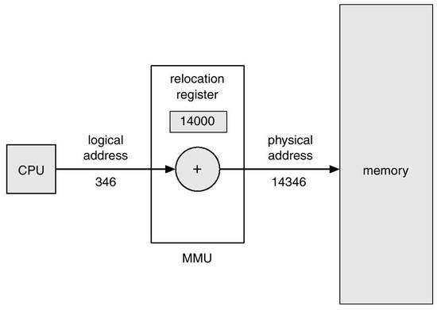
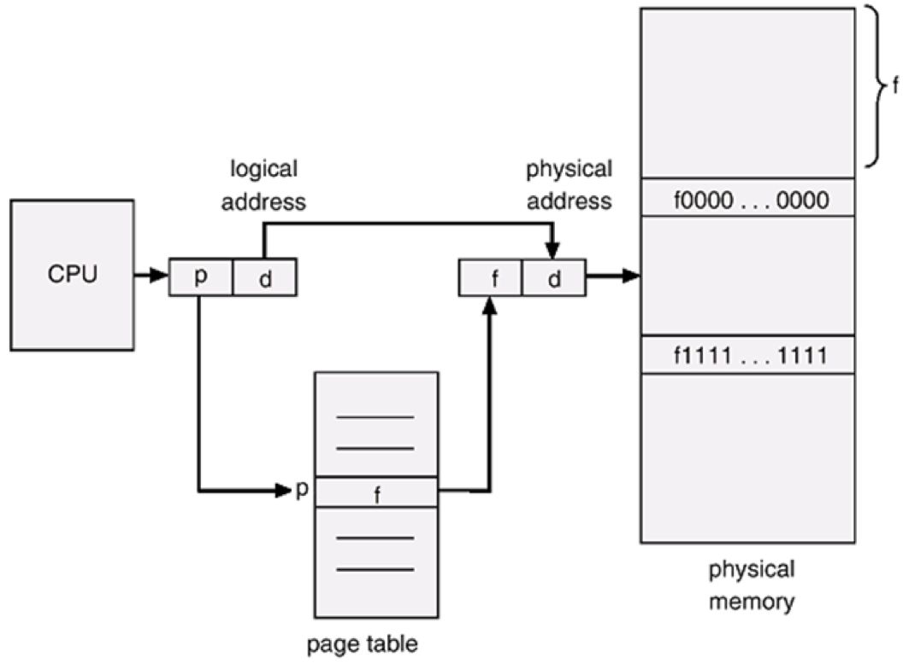
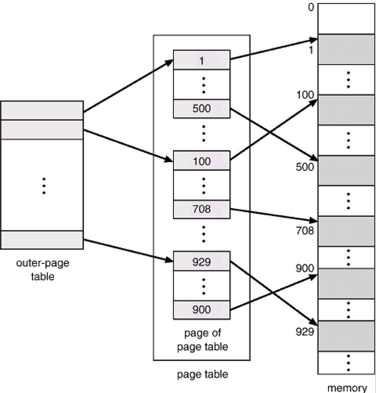
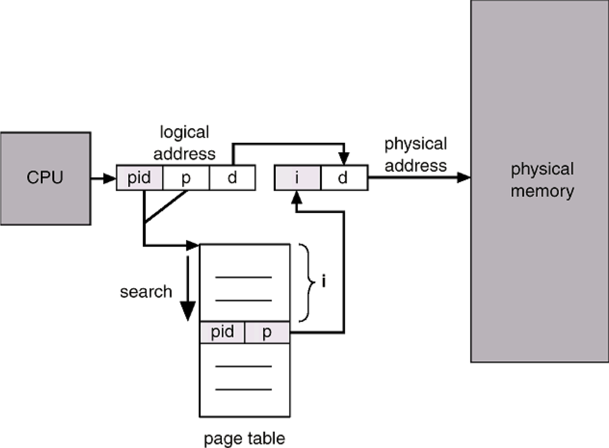
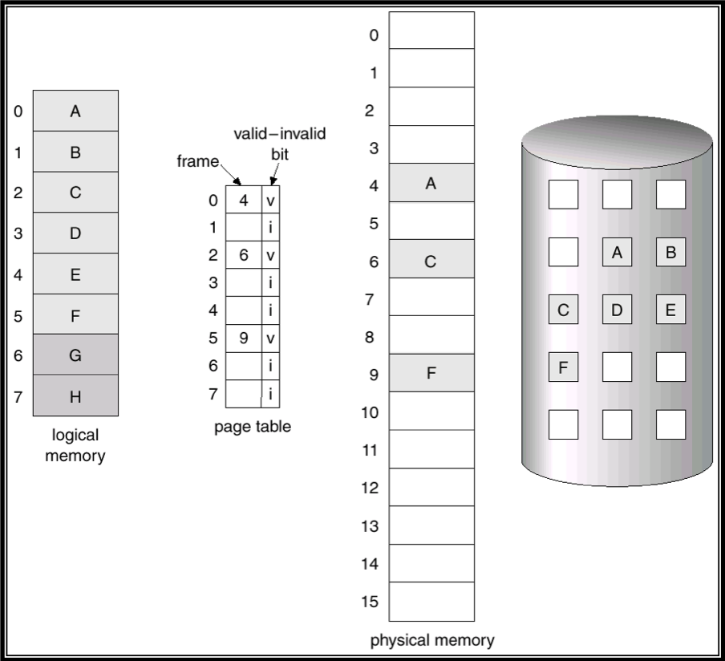
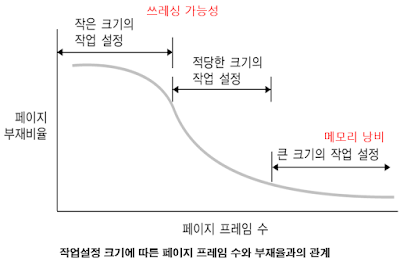

# 메모리 관리전략

## 서론
CPU의 활용률을 극대화하는 목적 아래, 사용자에게 빠른 응답을 제공하려다 보니 메모리에 보다 많은 프로그램이 로드되어 실행된다. 하지만 메모리는 **한정된 자원**이기 때문에 메모리 관리의 필요성이 등장했다.

## 주소 공간(Address Space)
정의
  - 프로세스에서 참조할 수 있는 주소들의 범위(집합)
  - 프로세스와 1-1의 관계
  - 사용자 스레드는 주소 공간을 공유

주소 공간의 크기
  - CPU의 주소 버스(address bus)의 크기에 의존
  - 주소 버스가 32bit인 시스템에서는 232개의 서로 다른 주소에 대한 식별자를 만들 수 있으므로 0부터 232-1 까지의 주소 범위를 가질 수 있다.

### 물리 주소와 가상 주소
- 물리 주소(physical address)
  - 컴퓨터의 메인 메모리를 접근할 때 사용되는 주소
  - 기억 장치의 주소 레지스터에 적재되는 주소
- 가상 주소(logical or virtual address)
  - CPU가 생성하는 주소로 프로세스 관점에서 사용
  - CPU 관점의 주소는 물리 주소도, 가상 주소도 될 수 있음(어떤 메모리 모델을 사용하느냐에 따라 달라짐.)

컴파일 타임과 적재 시에 바인딩을 할 경우 물리주소, 논리 주소가 같지만 **실행시간 바인딩 기법에서는 다르다**. 그래서 실행 중일 때 가상 주소를 물리 주소를 바꾸어줄 때 사용하는 것이 `메모리 관리기(MMU, Memory Management Unit)`이다.

메모리 관리기를 사용한 방법은 여러 가지 방법이 있다. 그 중 위의 그림과 같이 논리 주소를 물리 주소로 변환해 주는 `기준 레지스터(base register)`를 사용하는 방법이 있다. 여기서 기준 레지스터는 `재배치(relocation) 레지스터`라고 부른다.

**사용자 프로그램은 실제 메모리 주소에 대해 모른다는 것을 주의하자.** 단지 논리 주소만 알 뿐, 실제 실행되어 실제 메모리의 위치를 정하는 것은 기준 레지스터의 바인딩이다.

### 초창기 컴퓨터의 주소 관리
`물리 주소`를 Compile time에 생성한다.
- 컴파일러가 프로세스가 물리 메모리에서 실행되는 주소를 compile time에 알아서 절대 코드를 생성.
- 시작 주소의 위치가 바뀔 경우 다시 compile 해야함.

그러나 다양한 프로그램이 실행됨에 따라 compile time에 물리 주소를 정하기가 어려워지고 메인 메모리보다 큰 용량의 프로그램을 돌릴 수 없다.
 -> `가상 메모리`가 등장!

### 가상 메모리
프로세스가 수행되기 위해서 프로그램의 모든 부분이 실제 메모리(physical memory)에 올라갈 필요가 없고, 현재 실행되고 있는 code 부분만 올리자!
- 정의: 메모리로서 실제 존재하지는 않지만 사용자에게 메모리로서의 역할을 하는 메모리(virtual)

가상 메모리를 실제 메모리에 매핑하는 방법으로 `Page Table(페이지 테이블)`을 사용한다.

## Paging(페이징)
주소 공간을 동일한 크기의 page로 나누어 관리
- 보통 1page의 크기는 4KB로 나누어 사용.
- 프레임(Frame): 물리 메모리를 고정된 크기로 나누었을 때, 하나의 블록.
- 페이지(Page): 가상 메모리를 고정된 크기로 나누었을 때, 하나의 블록.
- 각각의 프레임과 페이지의 크기는 같다.

하나의 프레임에 하나의 페이지가 들어 갔다가 나갔다가 하면서 큰 용량의 여러 프로그램이 돌아갈 수 있다.

페이지가 하나의 프레임을 할당 받으면, 물리 메모리에 위치하게 된다. 하지만 받지 못한 페이지들은 외부 저장장치(Backing store)에 저장된다.

## 페이지 테이블

가상 주소를 실제 메모리 주소에 매핑하는 역할을 함.
- 각 프로세스의 페이지 정보를 저장함.
- 인덱스: 페이지 번호
- 내용: 해당 페이지에 할당된 물리 메모리(프레임)의 시작 주소. 시작 주소와 페이지 주소를 결합하여 원하는 데이터가 있는 물리 메모리 주소를 알 수 있다.

페이지 테이블은 물리 메모리에 위치하며 PTBR(Page-table base register)이 메모리의 내의 페이지 테이블을 가리키고, PTLR(Page-table length register)가 페이지 테이블의 사이즈를 나타낸다.

PTBR은 마치 PCB처럼 CPU 당 하나가 존재하면서 페이지 테이블의 위치를 알려줌.

- 페이지 테이블은 언제 만들어 질까?
  - 프로세스가 만들어 질 때 만들어짐.

### PTE(Page Table Entry)
페이지 테이블의 레코드로 페이지 테이블에 대한 정보를 담고 있다. 정보에는 할당된 프레임의 주소와 접근, 변경 등이 있었는지가 있다.

### TLB(Translation Look-aside Buffers)
페이징 방법을 사용하면 페이지 테이블에 한 번, 물리 메모리 내에 한 번, 즉 두 번 거쳐야하기 때문에 속도 문제가 존재.

그래서 캐쉬로 `TLB`를 사용하자! 페이지 테이블을 이용해 변환된 주소를 TLB에 저장해 놓고 다음에 접근할 때는 사용하자.

### Multilevel Page Table
- 가상 주소 공간이 매우 큰 용량을 차지하게 되어 페이지 테이블의 크기가 너무 커져 페이징이 잘 이루어지지 않음.
- 페이지 테이블을 가리키는 페이지 테이블을 만들어 해결.

- 레벨이 증가할 수록 페이지 테이블이 차지하는 메모리는 줄어들지만, **Table walk에 걸리는 시간이 증가하는 문제점이 발생**.

### Inverted Page Table
마찬가지로 페이지 테이블의 용량 증가를 해결하기 위한 대안으로 거꾸로 물리 메모리에서 가상 메모리의 페이지를 찾는 방식이다.
- PID를 통해 페이지 테이블에서 페이지 ID를 검색하고 일치하는 것이 있다면 그 가상주소를 물리 주소에 결합해 실제 물리 주소를 찾는다.

- 실제 존재하는 매핑된 페이지만 테이블에 저장하기 때문에, 용량이 적지만, 테이블을 검색하는 데 시간이 오래 걸린다.

### Demand Paging
프로세스의 실행을 위한 모든 페이지를 메모리에 올리는 대신, 필요한 page의 요청이 있을 때 올리는 페이징 기법.
- 필요한 페이지를 secondary storage에서 메모리로 옮김.
- 장점
  - 실행을 위한 물리 메모리 구성 시간이 줄어듦.
  - 프로세스의 전체 이미지를 올리지 않기 때문에 메모리 절약이 가능.
- 단점
  - 참조하고자 하는 페이지가 invalid 할 경우 실제 물리 메모리에 없으므로 `Page fault`가 발생.

- 위의 그림과 같이 페이지 테이블에 valid/invalid 플래그를 추가해 페이지 폴트가 발생했을 경우 `Page Fault Handler`를 실행한다.
- Page Fault Handler의 수행 내용
  1. 새로운 프레임 할당 받음
  2. Backing store에서 페이지의 내용을 다시 프레임에 불러들임.
  3. 페이지 테이블을 재구성.
  4. 프로세스의 작업 재시작.

### Thrashing
프로세스의 실행 시간 중, page fault를 처리하는 시간이 실행 시간보다 긴 상황.

- 요구 페이징 모델은 `지역성 모델(Locality model)`에 기반하여 동작하는데, 이는 **프로세스가 어떤 특정한 지역에서 메모리를 집중적으로 참조함**을 의미한다.
- 이 때 충분히 페이지를 할당 받지 못할 경우, 빈번한 페이지 교체로 인해 `스래싱`이 발생.
- 가장 최근에 참조된 페이지 집합인 `Working Set`을 메모리에 유지시켜 해결.

## 스와핑(Swapping)
CPU 할당 시간이 끝난 프로세스를 메인 메모리에서 예비 저장장치로 보내고 다른 프로세스를 메모리에 올리는 것을 말하며 메인 메모리보다 모든 프로세스들이 차지하는 물리 주소의 크기가 더 크더라도 동시에 실행할 수 있게 해 다중 프로그래밍의 정도를 증가시킴.

프로세스를 예비 저장장치로 보내는 것을 `swap out`, 메모리로 올리는 것을 `swap in`이라 한다.

### 기본 스와핑(Standard Swapping)
예비 저장장치는 보통 빠른 디스크를 사용함에도 불구하고, `문맥 교환 시간(context-switch time)`이 상당히 오래 걸린다. 이는 디스크 전송 시간이 대부분을 차지하며 이러한 스와핑의 단점 때문에 대부분의 운영체제에서는 기본 방식을 사용하지 않는다. 대신 자유 메모리가 임계량보다 부족하게 될 때 스와핑을 하거나, 프로세스의 일부 부분만을 스왑하는 식의 변형을 이용한다.

### 모바일 시스템에서의 스와핑
모바일 환경에서는 일반적으로 스와핑을 제공하지 않는다. 그 이유는 다음과 같다.

- 모바일 환경에서는 하드보다 플래시 메모리를 사용하기 때문에 용량이 적다.
- 플래시 메모리의 허용 쓰기 횟수가 정해져 있고, 메모리와 플래시 메모리의 처리량이 저조하다.

대신 모바일 환경에서는 메모리가 부족할 시 응용프로그램에 자발적으로 메모리를 반환하도록 요청한다. 이러한 모바일 환경에서의 제약때문에 그래서 개발자들은 응용 프로그램이 너무 많은 메모리를 잡지 않도록하고 메모리 누수가 일어나지 않도록 해야 한다. 한편, iOS와 Android 모두 `페이징`은 지원하므로 메모리 관리에는 문제가 없다고 한다.

### 메모리 할당 문제
메모리는 다양한 크기의 빈 공간(`자유 공간`)들이 있고 새로 올리려는 프로세스가 어디에 들어가는게 가장 효율적일지 판단해야 한다. 아래는 세 가지의 일반적인 기법들이다.

- 최초 적합(First-fit): 첫 번째 사용 가능한 가용 공간을 할당. 충분히 큰 가용 공간을 찾았을 때 검색을 끝냄.
- 최적 적합(Best-fit): 사용 가능한 공간들 중 가장 작은 것을 택함. 리스트가 크기 순으로 되어 있지 않다면 모두 검색해야 함.
- 최악 적합(Worst-fit): 가장 큰 가용 공간을 택함. 마찬가지로 리스트가 크기 순으로 되어 있지 않다면 모두 검색해야 함.

시간과 메모리 이용 효율 측면에서 최초 적합과 최적 적합 기법이 최악 적합보다 좋으며, 최초와 최적 중에 속도 면에서는 최초 적합이 일반적으로 더 빠르다.

### 단편화(Fragmentation)
메모리에 적재되고 제거되는 일이 반복되다보면, 어떤 자유 공간은 쓰지 못할 정도로 너무 작은 공간이 되어 버리는데, 이 현상을 `단편화`라고 한다. 두 가지가 있다.

- 외부 단편화: 유휴 공간들을 모두 합치면 충분한 공간이 되지만 그것들이 너무 작은 조각들로 **여러 곳에 분산되어 있을 때** 발생.
- 내부 단편화: 할당된 메모리 공간이 프로세스가 요구한 공간보다 더 커 남는 부분을 말한다. 더 큰 공간을 주는 이유는 조금의 차이로 못 주는 경우가 발생하기 때문에 운영체제는 메모리를 미리 일정 크기 단위로 분할해놓고 프로세스가 요청하면 분할된 크기의 정수 배만큼 주게 된다. 이 때 빈 공간이 생길 수 있다.

단편화를 해결하는 방법에는 `압축(compaction)`이 있는데 이는 메모리의 모든 내용들을 한 군데로 몰고 자유 공간들을 다른 한 군데로 모는 것이다. 그러나 비용이 매우 크다.

다른 방법으로는 프로세스의 논리 주소 공간을 비연속적으로 관리하는 것인데 이를 구현한 것이 `페이징`과 `세그먼테이션`이다.

## 세그먼테이션
`페이지`가 **물리적**인 크기로 프로세스를 나눈다면, `세그먼테이션`은 **논리적**인 크기로 프로세스를 나눈다. 여기서 논리적이란 뜻은 프로세스가 가지고 있는 다양한 함수, 객체, 배열, 스택, 변수 등 자료구조들을 의미상으로 나눈 것을 의미한다. 그렇기 때문에 페이지와 달리 세그먼테이션으로 나눈 각 세그먼트는 크기가 제각각이다.

세그먼테이션은 페이징과 마찬가지로 `세그먼트 테이블`이라 불리는 `MMU(메모릭 관리기)`를 사용해 논리 주소를 물리 주소로 변환한다. 세그먼트의 논리 주소는 `<번호(segment-number), 변위(offset)>`으로 구성된다.  세그먼트 테이블은 `세그먼트 번호`로 접근이 가능하며 각 항목은 세그먼트의 `기준(base)`과 `한계(limit)`를 가지고 있다. 기준은 세그먼트의 시작 주소를, 한계는 세그먼트의 길이를 표현한다.

논리 주소의 변위는 0과 세그먼트 크기의 값이며 그렇지 않은 경우는 `트랩(trap)`을 발생시킨다. 이 범위 안에 있으면 변위와 세그먼트의 기준이 더해져 실제 물리 주소를 얻을 수 있다.
