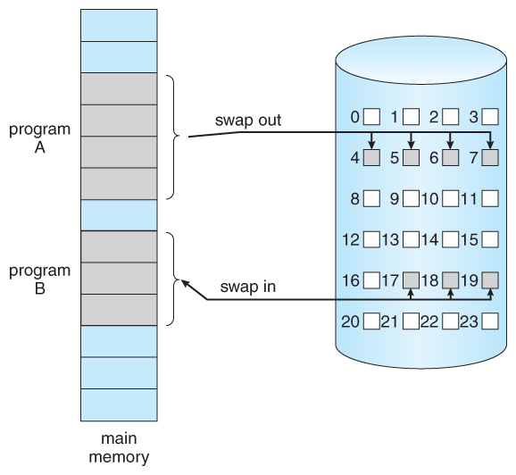
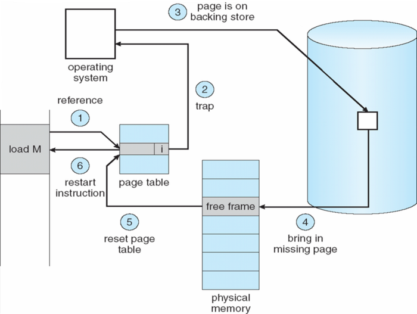
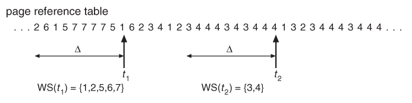

# 가상 메모리 Part 1

## 가상 메모리의 등장 배경

이전까지 논의했던 메모리 관리 전략에 대한 것들은 다음의 제약사항을 전제로 두고 있었다.

> 현재 실행되고 있는 코드는 반드시 물리 메모리에 존재해야 한다.

이 요구조건은 프로그램의 크기를 물리 메모리의 크기로 제한한다는 점 때문에 불편한 점이 많았다. 실제 프로그램들을 살펴보면, 사실 많은 경우에 프로그램 전체가 메모리에 항상 올라와 있을 필요는 없다는 것을 알 수 있다. 요구조건 떄문에 불필요하게 메모리에 올라와 있는 것들로는 다음의 것들이 있다.

- 자주 발생하지 않는 오류를 처리하는 코드
- 배열, 리스트, 테이블 등 실제 사용량보다 큰 메모리 공간을 할당하는 코드
- 프로그램 내의 자주 사용되지 않는 옵션같은 기능들

만약 프로그램의 일부분만 메모리에 올려놓고 실행할 수 있다면 다음과 같은 이점을 얻을 수 있다.

- 프로그램이 물리 메모리 크기에 의해 더 이상 제약받지 않게 된다. 따라서 동적 적재에 대하여 고민할 필요도 없어진다.
- 각 프로그램이 더 작은 메모리를 차지하게 되므로 다수의 프로그램이 동시에 실행될 수 있다. 이에 따라 응답 시간은 늘어나지 않으면서 CPU 이용률과 처리율은 높아진다.
- 스왑 작업에 필요한 입출력 횟수가 줄어들어 프로그램들이 보다 빨리 실행된다.

가상 메모리는 이것을 가능하게 한다. 가상 메모리는 물리 메모리 개념과 논리 메모리 개념을 분리한 것이다. 프로그래머는 작은 물리 메모리만으로도 얼마든지 큰 가상 주소 공간을 제공받을 수 있기 때문에, 메모리 크기 문제에 대한 염려 없이 해결하고자 하는 문제에만 집중할 수 있다.

물리 메모리에 프로세스를 적재하는 일은 운영체제가 관여하지 않는다. 그렇지만 가상 메모리와 관련한 것들은 전적으로 운영체제가 관여한다.

## 요구 페이징 (Demand Paging)

프로그램을 디스크에서 메모리로 적재시키는 방법에 대하여 생각해보자. 프로그램 시작 시 프로그램 전체를 메모리에 올리는 방법이 있을 것이다. 그런데 이 방법은 초기에는 메모리에 있을 필요가 없는 부분까지 적재된다는 단점이 있다. 요구 페이징 방식을 따르면 초기에 필요한 것들만 적재할 수 있다. 요구 페이징을 사용하는 가상 메모리에서는 페이지들이 실행과정 중에 실제로 필요해질 때 적재된다. 즉, 한 번도 접근되지 않는 페이지는 전혀 적재되지 않는 것이다.

요구 페이징을 사용하면 다음의 이점을 얻을 수 있다.

- I/O 양 감소
- 메모리 사용량 감소
- 응답 시간 감소: 시스템 전반의 관점, 하나의 프로세스 관점은 아님.
- 사용자 수용력 증가

### 페이저와 스왑퍼

요구 페이징 기법은 스와핑 기법과 비슷한 면이 있다. 프로세스는 보조 메모리(디스크)에 존재하다가 실행하고 싶으면 메모리로 읽어 들인다(swap in). 이 때 전체 프로세스를 읽어오는 대신 게으른 스왑퍼(lazy swapper)를 사용하여 필요한 것들만 읽어온다.

스왑퍼라는 용어는 요구 페이징에서 적절하지 않다. 대신 페이저(pager)라는 용어를 쓰기로 하자. 프로세스를 하나의 연속된 주소 공간으로 보기보다는 페이지들의 연속으로 생각할 수 있기 때문이다. 스왑퍼는 전체 프로세스의 관점의 용어이고, 페이저는 프로세스 내의 개별 페이지 관점의 용어이다.

### 유효-무효 비트 (Valid-invalid Bit)

swap in이 발생할 때 페이저는 프로세스가 swap out되기 전에 어떤 페이지들이 사용될 것인지 추측한다. 이렇게 하려면 각 페이지가 디스크에 있는지 메모리에 있는지 구별해야 할 필요가 있다. 유효-무효 비트 기법이라는 약간의 하드웨어적 지원을 통해 이것은 가능해진다. 유효-무효 비트가 의미하는 바는 다음과 같다.

- 유효 비트(Valid bit, v)
  - "해당 페이지가 메모리에 있다."
- 무효 비트(Invalid bit, i)
  - "해당 페이지가 유효하지 않다. 즉, 가상 주소 공간에 존재하지 않는다."
  - "또는 유효하지만 디스크에 존재한다."

페이지 테이블은 프레임과 유효-무효 비트로 구성되어 있다. 최초에는 모두 무효 비트로 초기화된다. 메모리에 올라오는 페이지에 대해서는 비트를 유효로 설정하고 프레임에는 해당 논리 메모리 주소를 기록한다. 반면에 메모리에 올라와 있지 않은 페이지에 대해서는 무효로 설정하거나 페이지가 저장되어 있는 디스크의 주소를 기록해둔다.

### 페이지 부재 (Page Fault)

제대로 추측하여 실제로 접근될 페이지들만을 메모리에 적재한 경우, 프로세스는 모든 페이지가 메모리에 존재할 때와 동일하게 실행된다고 볼 수 있다. 이렇듯 메모리에 존재하는 페이지들만 접근하는 한 실행은 정상적으로 진행된다.

그런데 만약 프로세스가 메모리에 올라와 있지 않는 페이지에 접근하려고 한다면 페이지 부재 트랩(page fault trap)이 발생한다. 페이징 하드웨어가 페이지 테이블을 참고하여 주소 변환을 하는 과정에서 무효 비트를 발견하고 운영체제에 트랩을 거는 것이다. 이렇게 되면 CPU 제어권은 자동적으로 운영체제에게 넘어간다. 페이지 부재를 처리하는 과정은 다음과 같다.

1. 프로세스의 내부 테이블을 검사해서 메모리 참조가 유효한지 무효한지 확인한다.
2. 페이지 부재 트랩이 발생한다. 무효한 페이지에 대한 참조라면 프로세스는 중단된다.
3. 유효하지만 메모리에 올라와 있지 않다면 디스크로부터 가져올 준비를 한다.
4. 빈 공간, 즉 자유 프레임(free frame)을 찾는다. 새롭게 할당된 프레임으로 해당 페이지를 읽어 들이도록 요청한다.
5. 디스크에서 읽어오는 것이 끝나면, 페이지 테이블을 갱신하여 페이지가 이제 메모리에 있음을 알린다. 그리고 프로세스의 내부 테이블도 수정한다.
6. 트랩에 의해 중단되었던 명령어를 다시 실행한다. 이제 프로세스는 찾고 있던 페이지에 접근할 수 있다.

프로세스가 요구하는 모든 페이지가 메모리에 올라와 있어 더 이상 페이지 부재가 발생하지 않는 것을 순수 요구 페이징(pure demand paging)이라고 한다.

### 요구 페이징의 성능

페이지 부재율(page fault rate) p는 0에서 1 사이의 값을 가진다. 0이면 발생하지 않는 것이고 1이면 항상 발생한다는 것이다.

유효 접근 시간(effective access time)은 다음 두 가지의 합이다. 두 번째 항목인 페이지 폴트 처리시간은 상대적으로 매우 긴 시간을 소요하므로 가능한 한 p를 작게 만드는 것이 바람직하다.

- 페이지 부재가 없는 시간: `(1-p) * 메모리 접근시간`
- 페이지 부재 시간: `p * 페이지 부재 처리시간`

## 쓰기 시 복사 (Copy-on-Write)

`fork()` 시스템 호출을 통해 프로세스를 생성할 때에는 페이지 공유와 비슷한 기법으로 첫 요구 페이징을 생략할 수 있다. 이렇게 하면 프로세스 생성 시간을 줄일 수 있고, 새로 생성된 프로세스에 새롭게 할당되어야 하는 페이지의 수도 최소화할 수 있다.

`fork()`는 부모 프로세스와 똑같은 자식 프로세스를 만드는 명령어이다. 과거에는 `fork()`하면 부모 프로세스의 페이지들을 자식 프로세스에 복사해 줌으로써 자식 프로세스의 주소 공간을 구성하였다. 그러나 페이지를 바로 복사할 필요 없이 쓰기 시 복사 방식을 사용할 수 있다. 이 방식에서는 자식 프로세스가 부모의 페이지를 당분간 함께 사용하도록 한다. 그리고 둘 중 한 프로세스가 공유 중인 페이지에 쓰기(write)를 할 때에야 비로소 해당 페이지의 복사본이 만들어진다.

## 프레임 할당(Allocation of Frames)

다양한 프로세스들에게 제한된 가용 메모리를 어떻게 할당할 것인지에 대한 문제가 있다. 프로그램이 원활하게 실행되려면 최소한의 프레임이 보장되어야 한다. 예를 들어 어떤 loop를 구성하는 페이지들이 한꺼번에 할당되지 않는다면, 가용 페이지가 다 떨어져서 페이지 부재가 발생할 것이다.

최소한의 프레임을 할당해야만 하는 이유는 성능과 관련이 있다. 프레임 수가 줄어들면 페이지 부재율을 증가하고 프로세스 실행은 늦어지게 된다. 또 명령어 실행이 완료되기 전에 페이지 부재가 발생하면 명령어를 다시 실행해야 한다. 따라서 하나의 명령어가 참조하는 모든 페이지를 적재할 수 있도록 충분한 프레임을 확보해야 한다.

### 할당 알고리즘

다수의 프로세스에 프레임을 할당하는 알고리즘에는 다음 세 가지가 있다.

- 균등 할당(equal allocation): 모든 프로세스에 동일한 수의 프레임 할당
- 비례 할당(proportional allocation): 각 프로세스 크기에 비례하여 할당
- 우선순위 할당(priority allocation): 각 프로세스의 우선순위에 따라 할당

### 전역 교체 vs. 지역 교체

페이지 교체 알고리즘은 넓게 보면 다음의 두 범주로 나누어서 생각해볼 수 있다.

- 전역 교체(global replacement)
  - 프레임 교체 시 다른 프로세스에 할당된 프레임을 포함한 모든 프레임들 중에서 선택
  - 프로세스 별 프레임 수 가변적
  - 프레임을 많이 필요로 하는 프로세스에게 많이 할당되는 것은 좋지만
  - 특정 프로세스가 독차지하게 될 가능성 존재
  - 작업 집합(working-set), 페이지 부재 빈도(PFF)에 사용
- 지역 교체(local replacement)
  - 프로세스 자신에게 할당된 프레임들 중에서만 교체할 프레임을 선택
  - 프로세스 별 프레임 수가 고정적

## 쓰레싱(Thrashing)

메모리에 적재된 프로그램의 수가 많아질수록, 프로세스들이 프레임을 잘게 나누어 가지게 되어 페이지 부재가 발생할 가능성이 커진다. 페이지 부재가 발생하면 곧바로 읽어 들여야 할 페이지를 연속적으로 교체하게 되는데 이것을 쓰레싱이라고 한다. 쓰레싱이 발생하면 CPU 이용률과 처리율이 하락한다.

CPU가 페이지 부재를 처리하느라 바빠질수록 CPU 이용률은 낮아지는데, 이것을 놀고 있는 것으로 판단하여 다중 프로그래밍 정도를 높이기 위해 프로그램을 더 적재시키게 된다. 따라서 쓰레싱이 심화될 수 있다.

쓰레싱을 방지하기 위해서는 각 프로세스가 필요로 하는 개수만큼 프레임을 할당해야 한다. 각 프로세스가 필요로 하는 프레임의 수를 알 수 있는 방법에는 다음의 두 가지가 있다.

- 작업 집합 모델(Working-Set Model)
- 페이지 부재 빈도(PFF, Page-Fault Frequency)

### 작업 집합 모델(Working-Set Model)

#### 지역성 모델(Locality Model)

프로그램은 한 명령어에서도 여러 페이지 부재를 일으킬 수 있다. 다행히 실행 중인 프로세스에서는 이러한 일이 거의 발생하지 않는다. 모든 프로그램은 참조 지역성(locality of reference)이라는 성질을 가지고 있어 작은 부분만 특정하여 한동안 집중적으로 참조하는데 이 덕분에 요구 페이징은 만족할 만한 성능을 보인다.

지역성 모델에서는 실행 중인 프로세스는 지역에서 지역으로 이동한다고 말한다. 지역이란 활발하게 함께 참조되는 페이지들의 집합을 말한다. 한 프로그램은 여러 개의 지역으로 구성되어 있고, 지역들은 서로 겹칠 수 있다.

어떤 프로세스가 필요로 하는 프레임이 충분하게 제공된다면, 현재 지역의 모든 페이지가 메모리로 올라오는 동안에는 페이지 부재가 발생하겠지만 그 후에는 거의 발생하지 않는다. 반대로 프레임이 부족하게 할당되면 해당 프로세스는 접근해야 하는 모든 페이지를 메모리에 유지할 수 없기 때문에 쓰레싱이 발생하게 된다.

#### 작업 집합(Working Set)

작업 집합 모델은 지역성 모델을 토대로 하고 있다. 이 모델은 작업 집합 구간(working-set window)을 정의한다. 작업 집합 구간은 일종의 창으로서, 크기는 고정적이고 시간 순서에 따라 참조 테이블의 일부를 투영한다. 작업 집합 구간 안에 들어 있는 서로 다른 페이지들의 집합을 작업 집합(working set)이라 부른다.

아래 예시에서 작업 집합 구간의 크기는 10이다. t1에서 작업 집합은 {1,2,5,6,7}이고, 조금 시간이 지난 뒤인 t2에서 작업 집합은 {3,4}이다.

이 모델에서 가장 중요한 요소는 작업 집합의 크기이다. 시스템이 보유한 메모리보다 작업 집합이 요구하는 메모리가 더 크게 되면, 몇몇 프로세스는 충분한 프레임을 가질 수 없어서 쓰레싱이 발생한다. 예를 들어 t1에서 작업 집합이 요구하는 최소 크기가 5개인데, 만약 시스템이 제공할 수 있는 것은 4개 뿐이라고 하자. 이 경우에 아쉬운대로 4개만 쓰기로 결정한다면 앞으로 계속해서 페이지 부재가 발생하여 쓰레싱이 심화될 것이다.

그런데 아예 swap out하여 프로세스는 suspended 상태로 바꾸는 방법이 있다. 이 방식을 따르면 다중 프로그래밍의 정도를 낮추어 쓰레싱을 방지할 수 있다.

### 페이지 부재 빈도(PFF, Page-Fault Frequency)

쓰레싱을 방지하는 다른 방법으로는 페이지 부재 빈도를 활용하는 것이다. 이 방식은 보다 직접적으로 쓰레싱을 조절한다.

쓰레싱이란 페이지 부재율이 높은 것을 말한다. 페이지 부재율이 너무 높으면 그 프로세스가 더 많은 프레임을 필요로 한다는 것을 의미한다. 반대로 너무 낮으면 프로세스가 너무 많은 프레임을 가지고 있다는 것을 의미한다. 페이지 부재 빈도 방식은 그림과 같이 페이지 부재율의 상한과 하한을 정하여 부재율이 그 사이에 있도록 조정하는 방식이다. 부재율이 상한을 넘으면 그 프로세스에게 프레임을 더 할당하고, 하한을 넘으면 프레임을 줄인다.

작업 집합 방식과 마찬가지로 여분의 프레임이 충분히 남아있지 않다면 아예 swap out하여 프로세스를 suspended 상태로 바꾼다. 이런 식으로 쓰레싱을 방지할 수 있다.

## 페이지 크기 결정

전통적으로 32비트 메모리 주소 체계를 사용하는 시스템은 4KB의 페이지 크기 사용한다. 하지만 시간이 지나면서 점차 메모리의 크기가 증가하고 프로그램 크기도 커짐에 따라 페이지의 크기도 커지고 있는 추세이다.

페이지 크기를 크게 한다는 것은 큼직하게 쓴다는 것이고, 작게 한다는 것은 잘게 쓴다는 것이다. 각각의 장단이 있는데 작게 하는 경우의 장단점들은 다음과 같다.

- 장점
  - 내부단편화 최소화
  - 필요한 정보만 메모리에 올라와 메모리 이용이 효율적
- 단점
  - 전체 페이지 수가 증가하여 그만큼 페이지 테이블 크기가 커진다.
  - 페이지 부재 발생 시 지역성으로 인하여 반복적인 부재 발생 가능성 높음
  - 따라서 디스크 전송 효율 감소

#### References

- [[강의] 운영체제, 반효경, 이화여자대학교, 2017 - KOCW](http://www.kocw.net/home/search/kemView.do?kemId=1226304)
- Operating System Concepts (8th Edition), Abraham Silberschatz, 홍릉과학출판사
