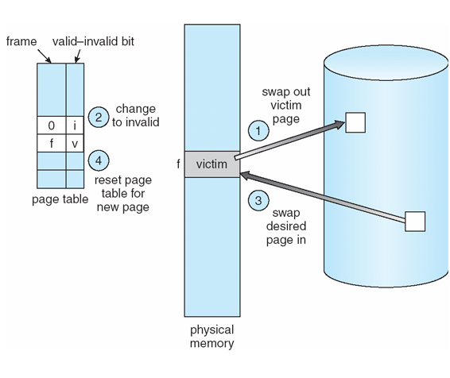
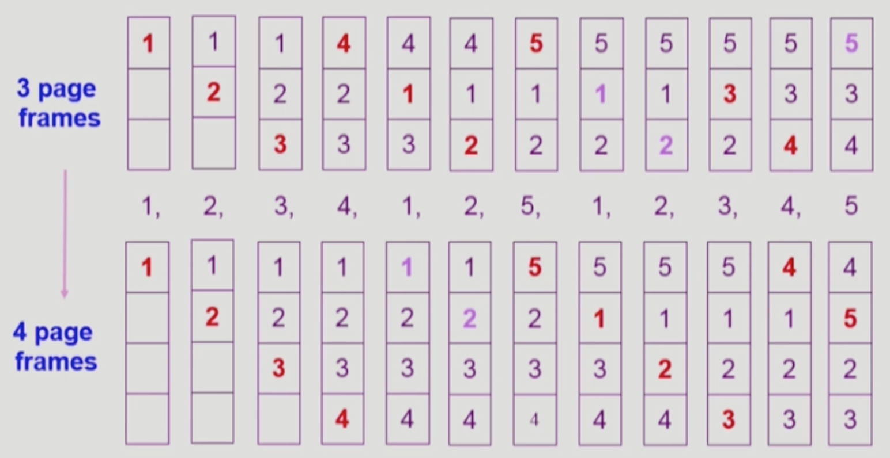
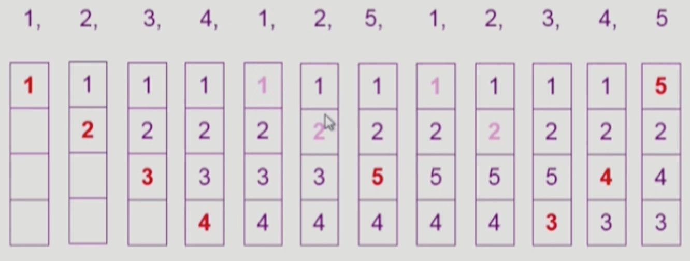
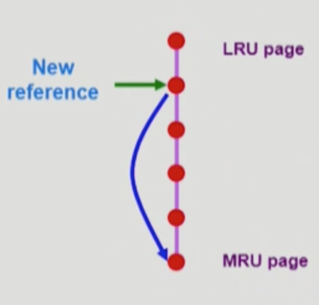
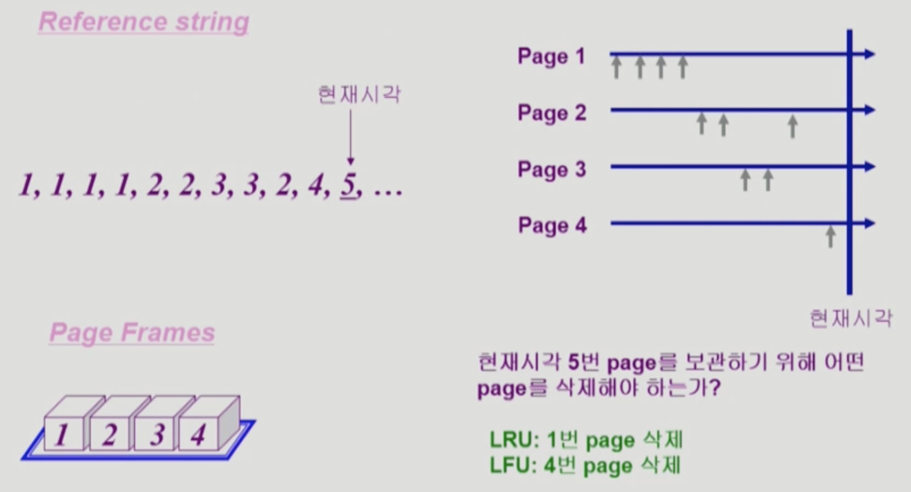
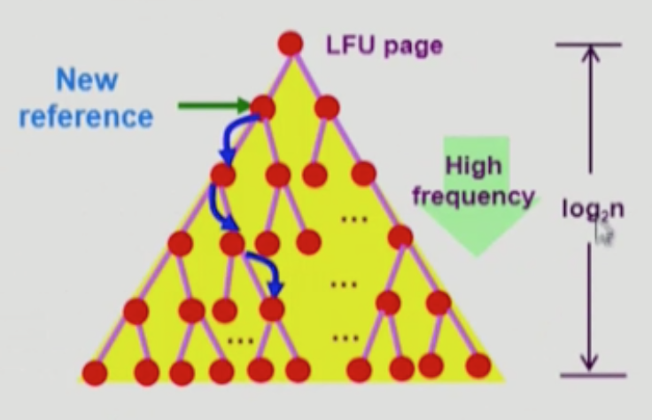

# 가상 메모리 Part 2

## 페이지 교체

페이지 부재를 처리하는 과정 중에 빈 프레임(free frame)을 찾는 단계가 있다. 이 때 빈 프레임이 없다면 현재 사용되고 있지 않는 프레임을 찾아서 이것을 비우고 사용해야 한다. 위 그림의 설명에 해당하는 과정은 다음과 같다.

1. 기존에 프레임에 담겨 있던 페이지(victim page)를 스왑 공간에 쓴다(swap out).
2. victim page가 메모리에 더 이상 존재하지 않는다는 것을 나타내기 위해 페이지 테이블을 수정한다(invalid).
3. 페이지 부재를 처리하기 위해 필요한 페이지를 스왑 공간으로부터 프레임으로 가져온다(swap in).
4. 새로 들어온 페이지를 반영하기 위해 페이지 테이블을 reset한다(valid).

## 페이지 교체 알고리즘

페이지 교체 알고리즘은 프레임 할당 알고리즘과 함께 요구 페이징 시스템에서 가장 중요한 두 가지 문제이다. 페이지 교체 알고리즘을 통하여 페이지 교체가 필요할 때마다 어떤 페이지를 교체해야 할지 결정한다.

페이지 교체 알고리즘에는 여러 가지가 있다. 일반적으로 페이지 부재율이 가장 낮은 것을 좋은 알고리즘으로 평가한다. 가까운 미래에 사용되지 않을 페이지가 희생될 페이지(victim page)로서 적합하다. 금방 다시 사용될 페이지가 선정된다면 그만큼 페이지 부재와 교체가 자주 발생하기 때문이다.

페이지 부재 발생 횟수를 알기 위해 다음의 참조열을 사용할 것이다.

> 1 2 3 4 1 2 5 1 2 3 4 5

### FIFO 알고리즘

FIFO 알고리즘은 가장 간단한 페이지 교체 알고리즘이다. 이 알고리즘은 각 페이지마다 메모리에 적재된 시간을 기억한다. 또는 시간을 기록하는 대신 큐를 이용하여 들어온 순서를 기록한다. 그러다가 페이지를 교체해야 할 때 가장 오래된 페이지를 내쫓는다.

앞으로의 그림에서 빨간 글자는 페이지 부재가 발생하여 페이지 교체가 일어난 것을 의미한다. 옅은 보라색 글자는 찾는 페이지가 메모리에 올라와 있어서 유효한 참조가 발생했음을 의미한다.

일반적으로 가용 페이지 프레임 수와 페이지 부재율은 부의 상관관계를 가진다. 즉 프레임 수가 늘수록 페이지 부재율은 줄어든다는 뜻이다. 그런데 위의 경우에는 그렇지 않다. 3개의 프레임으로 구성된 경우의 페이지 부재는 9회, 4개로 구성된 경우에는 10회 발생하였다. 이러한 모순을 Belady의 모순(Belady's anomaly)이라 한다. 이것은 FIFO 알고리즘의 큰 단점이다.

### 최적 페이지 교체 (Optimal Page Replacement, OPT)

Belady의 모순으로 인해 최적의 알고리즘이 어떤 것인지에 대한 탐구가 시작되었다. 최적 페이지 교체 알고리즘은 다른 모든 알고리즘보다 낮은 페이지 부재율을 보인다. 왜냐하면 이 알고리즘은 미래에 프로세스가 메모리를 어떻게 참조할 것인지 전부 알고 있다는 가정을 하고 있기 때문이다. 이 알고리즘은 다음의 문장을 기본 아이디어로 한다.

> 앞으로 가장 오랫동안 사용되지 않'을' 페이지를 찾아 교체하라.

이 알고리즘은 이론적이기만 하고 비현실적이기 때문에 실제로 사용할 수는 없다. 그렇지만 다른 알고리즘의 성능 평가를 위한 상한(upper bound)을 제공한다는 의의가 있다. Belady가 제안하였고 다른 이름으로는 OPT, MIN이 있다.

6회의 페이지 부재가 발생하였다. 다른 어떤 알고리즘도 페이지 부재가 6회보다 적게 발생할 수 없다.

### LRU 알고리즘 (Least Recently Used)

미래를 내다볼 수 없다면 과거를 되돌아보자는 아이디어를 바탕으로 하는 알고리즘이다. 최근의 과거를 가까운 미래의 근사치로 보아 가장 오랜 기간 동안 사용되지 않은 페이지를 교체하는 것이다.

이 알고리즘은 각 페이지마다 마지막 사용 시간을 기록한다. 페이지 교체 시 가장 오랫동안 사용되지 않은 페이지를 선택하여 내쫓는다. 뒤집어 생각하면 최근에 사용된 페이지일수록 금방 다시 사용될 것이라는 가정이 깔려 있는 것이다.

페이지 부재가 8회 발생하였다.

#### 구현 방법

LRU 알고리즘은 자주 사용되며 좋은 알고리즘으로 인정받고 있다. 그렇지만 이것을 구현하기 위해서는 하드웨어적 지원이 필요하다. 최근에 사용된 시간 순서로 프레임들을 파악할 수 있어야 하기 때문이다. 스택을 이용한 방법과 계수기를 이용한 방법이 있다.

스택을 이용한 방법은 페이지 번호들의 스택을 유지하는 것이다. 페이지가 참조될 때마다 어딘가에 위치한 페이지 번호는 제거되어 스택의 바닥에 위치하게 된다. 이러한 정책을 따르면 스택의 최하단은 항상 최근에 사용된 페이지가 된다. 반대로 꼭대기에 위치한 것은 가장 오랫동안 이용되지 않은 페이지로서, 페이지 교체 시 제거될 대상이다. 스택의 중간에서 페이지를 제거해야 할 필요가 있으므로 이중 연결 리스트로 구현한다. O(1)의 시간 복잡도를 가진다.

다음 그림은 스택의 위에서 두 번째 위치한 페이지가 참조되어 최하단으로 이동되는 것을 나타낸 것이다.

계수기를 이용한 간단한 방법도 있다. 각 페이지 항목마다 사용 시간 필드를 넣고 CPU에 논리적인 시계나 계수기를 추가하는 방식이다. 이렇게 하면 각 페이지의 마지막 참조 시간을 유지할 수 있기 때문에 교체해야 할 오래된 페이지를 찾을 수 있다.

### LFU 알고리즘 (Least Frequently Used)

LFU 알고리즘은 참조 횟수가 가장 작은 페이지를 교체하는 방법이다. 활발하게 사용되는 페이지는 그만큼 참조 횟수가 많을 것이라는 가정을 기본 아이디어로 한다. LRU 알고리즘이 페이지 참조의 최신성을 기준으로 한다면, LFU 알고리즘은 페이지의 참조 빈도 즉 인기도를 기준으로 한다.

위 그림은 프레임이 4개로 구성되어 있을 때 LRU와 LFU의 결과를 비교하는 것이다. LRU에 따르면 가장 최근에 참조된 페이지는 순서대로 4,2,3,1이기 때문에 페이지 1이 교체되어야 한다. 반면 LFU에 따르면 페이지 1은 4회, 페이지 2는 3회, 페이지 3은 2, 페이지 4는 1회 참조되었으므로 페이지 4가 교체되어야 한다.

LFU는 구현이 복잡하기 때문에 일반적으로 잘 사용되지 않는다. 또 LRU 알고리즘처럼 참조의 최신성은 반영하지 못하기 때문에, 한 순간 집중적으로 사용되고 이후에는 거의 사용되지 않는 페이지라 하더라도 교체 대상이 되지 않는다.

#### 구현 방법

LRU에서 스택을 이용한 구현처럼 연결 리스트 기반의 스택으로 LFU를 구현하는 것은 좋지 않다. 매번 참조 횟수를 비교해야 하기 때문에 시간 복잡도가 O(n)이 되기 때문이다. 따라서 스택 대신 힙을 활용한다. 루트 노드에 위치한 페이지의 참조횟수가 가장 작고 리프 노드 쪽으로 내려갈수록 참조 횟수가 증가한다. 이 방식의 시간 복잡도는 O(log n)이다.

### LRU와 LFU, 페이징 시스템에서 사용 가능한가?

앞서 살펴본 LRU나 LFU 알고리즘은 사실 페이징 시스템에서 사용이 불가능하다. 왜냐하면 이 알고리즘들이 추적할 수 있는 페이지는 페이지 부재가 발생한 것들로 한정되기 때문이다. 다시 말해 이미 메모리에 올라와 있어서 참조되는 페이지들에 대해서는 참조의 최신성 또는 빈도를 추적할 수 없다는 것이다.

실행 중인 사용자 프로세스가 메모리를 참조하는 것에는 운영체제가 관여하지 않는다. 운영체제가 관여하는 것은 오직 페이지 부재가 발생한 때로 한정된다. 그렇기 때문에 LRU나 LFU 알고리즘은 페이지들의 참조를 충분히 반영할 수 없다는 한계를 지닌다.

### LRU 근사 페이지 교체 알고리즘

결국 진정한 의미의 LRU 알고리즘은 사용할 수 없다. 다만 하드웨어적인 지원을 받아 LRU에 가까운 알고리즘을 구현할 수는 있다. 다음에 소개하는 알고리즘들은 LRU에 근사하는 페이지 교체 알고리즘이다.

#### 2차 기회 알고리즘 (Second-Chance Algorithm)

참조 비트(reference bit)를 활용하여 참조가 있을 때마다 하드웨어가 해당 페이지에 대한 참조 비트를 설정한다. 최초에 모든 참조 비트는 0으로 초기화된다. 프로세스가 실행되면서 참조되는 페이지의 비트는 하드웨어에 의해 1로 설정된다. 이런 방식을 도입함으로써 얼마나 최근에 사용되었는지 페이지들 간의 순서는 알 수 없지만, 적어도 페이지가 그동안 사용되었는지 아닌지는 알 수 있다. 이것이 LRU 근사 알고리즘의 기본이다.

2차 기회 알고리즘은 순환 큐를 사용한다. 페이지가 선택될 때마다, 시계 바늘이 시계를 돌 듯이 포인터가 참조 비트를 확인한다. 확인한 참조 비트가 1이면 최근에 한 번은 사용된 것이므로 기회를 주어 살려둔다. 이렇게 포인터가 전진하면서 참조 비트를 전부 0으로 바꾼다. 자주 참조되는 페이지는 1을 유지할 것이므로 교체될 가능성이 적어진다.

만약 참조 비트가 0인 페이지가 발견되면 이 페이지는 교체되고 새로운 페이지가 순환 큐의 그 자리에 삽입된다. 최악의 경우에는 모든 비트가 1인 경우인데 이 때 포인터는 순환 큐를 한 바퀴 돌면서 모두 0으로 바꾸고 제자리로 돌아오게 된다. 이 경우 2차 기회 알고리즘은 FIFO 알고리즘과 다를 바가 없어진다.

참조 비트를 1에서 0으로 바꾸어 2차 기회를 주는 것은 운영체제에 의한 것임을 기억하자. 이와 반대로 페이지가 참조되어 0에서 1로 바뀌는 것은 하드웨어에 의한 것임도 기억하자. 이와 같은 하드웨어 지원은 LRU, LFU에는 없는 특징적인 부분이다.

2차 기회 알고리즘은 clock algorithm, NUR(Not Used Recently), NRU(Not Recently Used)로도 불린다.

#### 개선된 2차 기회 알고리즘 (Enhanced Second-Chance Algorithm)

변경 비트(modified bit, dirty bit)를 추가로 도입하여 2차 기회 알고리즘은 개선시킬 수 있다. 변경 비트는 페이지가 메모리에 올라온 이후로 write에 의해 적어도 한 번 변경되었으면 1, 그렇지 않으면 0으로 표시된다. 참조 비트와 변경 비트를 순서쌍으로 생각하여 네 가지 경우를 생각해볼 수 있다.

1. (0, 0): 최근에 사용되지 않았고 변경되지도 않은 페이지 - 교체하기 가장 좋은 페이지
2. (0, 1): 최근에 사용되지 않았지만 변경이 된 페이지 - 교체하기 전에 디스크에 먼저 기록해야 하는 페이지
3. (1, 0): 최근에 사용되었으나 변경은 없는 페이지 - 다시 사용될 가능성이 높은 페이지
4. (1, 1): 최근에 사용되었고 변경도 된 페이지 - 재사용 가능성이 높고 디스크에 기록해야 할 페이지

모든 페이지는 위 네 가지 등급 중 하나에 속한다. 포인터가 돌면서 가장 낮은 등급이면서 처음 만난 페이지를 교체한다. 참조 비트와 다르게 변경 비트는 운영 체제에 의해 0으로 clear되지 않는다. I/O 횟수를 줄이기 위해 변경된 페이지를 우대하는 것이다. 변경된 페이지가 쫓겨나는 경우에는 우선 디스크에 변경을 반영한다. 변경되지 않은 페이지는 그냥 쫓아내기만 하면 끝이다.

## References

- [[강의] 운영체제, 반효경, 이화여자대학교, 2017 - KOCW](http://www.kocw.net/home/search/kemView.do?kemId=1226304)
- Operating System Concepts (8th Edition), Abraham Silberschatz, 홍릉과학출판사
